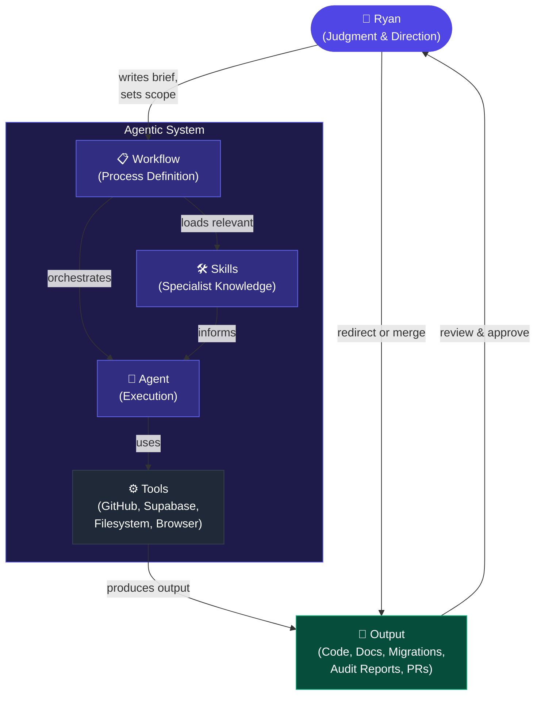
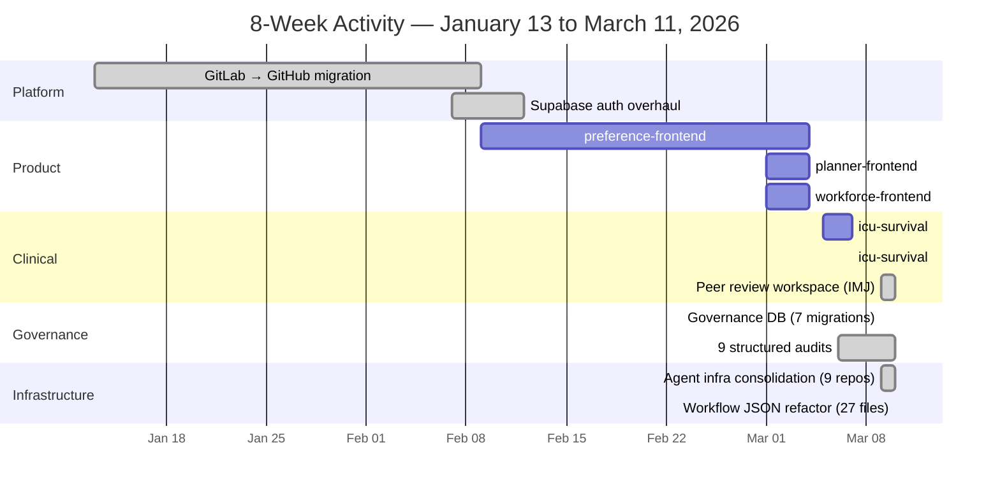
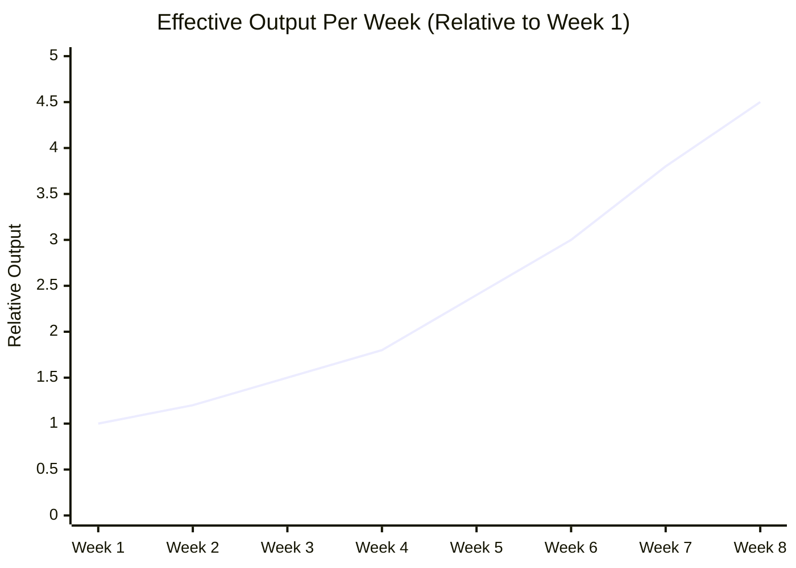

import hero from './hero.png'; import beforeAfter from './before-after.png';


There is a thing that happened over the past few months that I still find
difficult to fully articulate. The closest I have come is this: I stopped being
a musician and became a conductor.

<!--truncate-->

## What Changed

I have been building software since at least 2019 — the early commit history in
some of these repositories goes back that far. For most of that time, the job of
building something was: understand what to build, sit down, write code, debug
it, fix it, write docs, repeat. The thinking and the doing were the same person
doing the same thing.

What agentic AI with structured workflows and skills has done is separate those
two things cleanly.

I still do all the thinking. Every architectural decision, every prioritisation
call, every judgment about _what matters_, every review of whether the output is
actually correct — that's still mine. What I don't do anymore is translate every
decision into keystrokes.

The analogy that keeps coming back: a conductor does not play the instruments.
But a bad conductor produces a mess, and a great conductor can get something out
of 60 people that no individual musician could produce alone. The baton is a
communication tool. Mine is a structured prompt.

## The Evidence


I spent some time this week pulling the actual GitHub commit data across all my
repositories for the past 8 weeks. What came back was genuinely surprising, even
to me.

In that window, across 14 active repositories:

```
📦  120+  commits merged to production
🆕   5    new repositories created and bootstrapped  
✅   9    formal audits completed (findings → implementation → re-audit → archive)
🔐   1    full OAuth system built in a single session (15 commits in one day)
🏥   3    clinical data reports published (primary source, cross-validated)
🏛️   7    database migrations applied to a new governance schema
⚙️   9    repositories refactored simultaneously in a single coordinated sweep
```

Tasks that previously required weeks of focused implementation time now complete
in hours. The 9 audits I ran in this window would previously have been a
multi-month governance project. The clinical auth system would have been a week
of focused development. Instead, those things happened in parallel.

## How the System Works

The key insight is that _unstructured_ AI assistance is not what made this work.
Asking a model "help me write some code" produces mediocre results that need
constant correction. What works is **structured agentic workflows with skills**.



- **Workflows** define the _process_ for a class of task — how to run a
  structured audit, how to implement recommendations, how to finalise and
  archive it. They encode the steps, the verification gates, and the definition
  of done.
- **Skills** are specialist modules: one knows how the audit registry works, one
  knows the Supabase migration standards, one knows the Playwright testing
  patterns. An agent loads the relevant skills for the task it's doing.
- **The agent** reads the actual files, applies the specialist knowledge, and
  writes the output.
- **I review.** Every significant output comes back to me before it's committed.
  I am not a passenger.

## Eight Weeks of Parallel Work

This is what five simultaneous work streams actually look like across eight
weeks:



## What It Actually Feels Like

The _cognitive load_ is front-loaded and judgment-heavy. The _execution load_ is
almost entirely removed.

This matters economically. Tasks that required weeks of focused implementation —
because the cognitive overhead of tracking a complex codebase across multiple
files is itself exhausting and error-prone — now complete in hours.

What I provide is judgment. What the agents provide is execution. Neither is
sufficient alone.

## The Compounding Effect

This is the part hardest to explain. Every workflow I write makes the next
session of that type faster. Every skill I build encodes knowledge agents can
load on demand. Every audit I run produces structured recommendations that
future agents can implement without needing me to re-explain the context.



The 8-week period included a full infrastructure consolidation — 27 workflow
files standardised across 9 repositories. It doesn't ship a feature. But it
dramatically changes the cost of everything that comes after.

I am building faster now than I was in January. I will be building faster in May
than I am today. Not because I am getting smarter, but because the orchestra is
getting better rehearsed.

## What It Doesn't Change

The model does not know what to build. It does not know which tradeoffs are
acceptable for this business, this user, this regulatory context. It does not
catch its own errors reliably. It does not understand the broader strategic
context unless I provide it.

The conductor metaphor holds: the orchestra cannot play a concert without a
score, without a tempo, without someone who knows what the piece is supposed to
sound like.

What has changed is that I have stopped trying to play all 60 instruments
myself.

---

_The activity report this post references is
[also on this blog](/blog/8-week-activity-report)._
