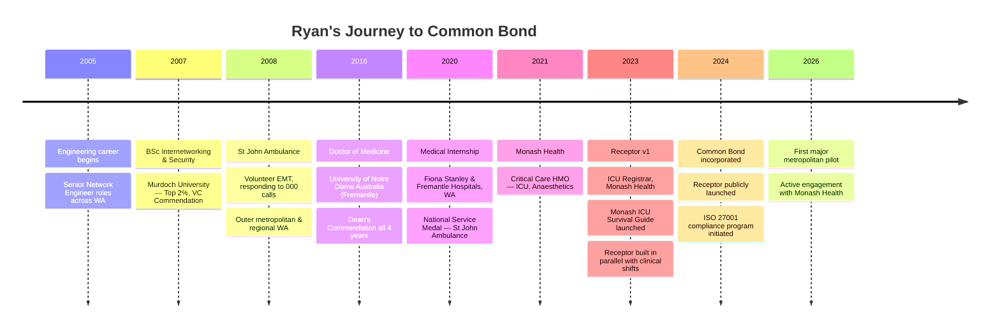

import { FrameworkCard, MatrixGrid } from
'@site/src/components/BusinessPlanning';

# Dr Ryan Ammendolea

**Founder & CEO, Common Bond**

<!-- TODO: add headshot image path -->

_"I've spent my career navigating both the clinical frontline and the technical
backend. I've seen first-hand how opaque allocation processes erode trust and
drive talented doctors out of the public system. Receptor exists to change
that."_

---

## The Origin Story

There are founders who spot a market gap from a spreadsheet. Ryan spotted his
from the inside of a hospital rotation.

As a junior doctor rotating through Australian hospitals, Ryan experienced
first-hand what thousands of doctors experience every year: being allocated to a
rotation without understanding why, suspecting bias, and having no recourse. The
allocation system was a black box. The frustration wasn't just personal
frustration — it was a systemic erosion of trust between health services and
their most important asset.

At the same time, Ryan had spent eleven years before medical school as a senior
IT Network Engineer — building complex, integrated systems for some of Western
Australia's largest organisations, including Fiona Stanley Hospital, the
Department of Agriculture, and a range of private engineering firms. He knew
that the problem he was experiencing as a doctor was fundamentally a **software
and process problem**, not an intractable human one.

So in 2023, while working as an ICU Registrar at Monash Health, Ryan began
building Receptor.

:::info[Still Practising]
Ryan continues to work as an Intensive Care Registrar at Monash Health, rotating across Dandenong, Casey, and Latrobe Regional hospitals. This active clinical practice is intentional — it ensures Receptor remains grounded in how healthcare actually works today, not how it worked when a vendor last visited a hospital.
:::
:::

---

## The Two Careers

Ryan holds dual qualifications that are rare in combination: a **Doctor of
Medicine** and a **Bachelor of Science (Internetworking & Security)**. Both were
pursued with distinction.

<MatrixGrid columns={2}>
  <FrameworkCard title="Clinician" icon="🩺">
    <ul>
      <li><strong>ICU Registrar</strong> — Monash Health, 2023–present</li>
      <li><strong>Critical Care HMO</strong> — Monash Health, 2021–2022</li>
      <li><strong>Intern</strong> — Fiona Stanley & Fremantle Hospitals, 2020</li>
      <li>MD, University of Notre Dame Australia — Dean's Letter of Commendation all 4 years</li>
    </ul>
  </FrameworkCard>
  <FrameworkCard title="Engineer" icon="💻">
    <ul>
      <li><strong>Senior Network Engineer</strong> — multiple organisations, 2005–2016</li>
      <li>Fiona Stanley Hospital, Dept. Agriculture WA, R-Group International</li>
      <li>BSc Internetworking & Security, Murdoch — Vice Chancellor's Commendation (Top 2%)</li>
      <li>15+ years delivering enterprise-grade infrastructure</li>
    </ul>
  </FrameworkCard>
</MatrixGrid>

---

## The Journey: 2005 – 2026

---

## Beyond Clinical & Engineering

Ryan's background includes 12 years as a volunteer Emergency Medical Technician
with **St John Ambulance Western Australia** — responding to 000 calls in outer
metropolitan and regional WA. He served on the management committee, coordinated
rosters, and trained new volunteers. In 2020 he was awarded the **National
Service Medal** for dedication and commitment beyond normal expectations.

He was also recognised as **Aboriginal Health Champion** at Fiona Stanley
Hospital in 2020, reflecting his commitment to equitable care.

---

## Why This Mission

> _"The public hospital system is haemorrhaging talented junior doctors not
> because clinical work is hard — doctors know it will be hard — but because the
> administrative layer that surrounds them is opaque, frustrating, and often
> perceived as unfair. A transparent, mathematically auditable allocation
> process doesn't just improve a roster. It changes how a doctor feels about
> their employer. That shift in trust is what Receptor is built to deliver."_
>
> — Dr Ryan Ammendolea

---

:::tip[Full Professional Profile]
For Ryan's complete professional CV — including publications, service improvement projects, and professional development — see the [Founder Profile in Business Strategy](../strategy/strategy-vision/founder).
:::
:::
