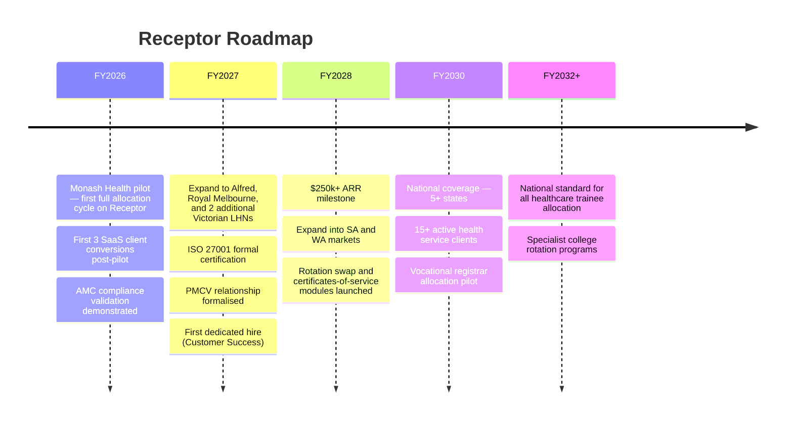

import { FrameworkCard, MatrixGrid } from
'@site/src/components/BusinessPlanning';

# Our Aims

**From a Monash Health pilot to the national standard for healthcare trainee
allocations.**

---

## Our 10-Year Target

> _"Every prevocational doctor in Australia is allocated fairly, transparently,
> and in full compliance with the AMC Framework — using Receptor."_

This is not abstract aspiration. It is a concrete target derived from a specific
and underserved market: 14,500+ prevocational doctors, 235+ health services, and
a compliance-forcing event (AMC 2024 Framework) that makes the status quo
untenable.

See [Vision](../strategy/strategy-vision/vision) for the full long-range
picture, including expansion beyond prevocational allocation.

---

## Roadmap

---

## 1-Year Goals (FY2026)

The immediate priority is converting our Monash Health engagement into a formal,
successful pilot — and then repeating that success a further three times.

<MatrixGrid columns={2}>
  <FrameworkCard title="🏥 Monash Health Pilot" icon="">
    <ul>
      <li>Formal pilot SLA signed</li>
      <li>First full rotation cycle allocated through Receptor</li>
      <li>Post-allocation satisfaction survey completed</li>
      <li>AMC compliance report generated automatically</li>
    </ul>
  </FrameworkCard>
  <FrameworkCard title="💰 First SaaS Revenue" icon="">
    <ul>
      <li>3 clients at the SaaS subscription tier</li>
      <li>Hybrid consulting → SaaS conversion confirmed</li>
      <li>Annual Recurring Revenue: initial traction established</li>
      <li>Customer feedback loop driving Q2 FY2027 roadmap</li>
    </ul>
  </FrameworkCard>
  <FrameworkCard title="🧾 Compliance" icon="">
    <ul>
      <li>ISO 27001 internal audit cycle complete</li>
      <li>All nonconformities from FY2025 remediated</li>
      <li>ISMS controls demonstrated to at least one client</li>
    </ul>
  </FrameworkCard>
  <FrameworkCard title="🤝 Relationships" icon="">
    <ul>
      <li>PMCV relationship progressed through formal introductory meeting</li>
      <li>Advisory board: 1 clinical + 1 commercial advisor engaged</li>
      <li>StartSpace network actively leveraged for founder peer support</li>
    </ul>
  </FrameworkCard>
</MatrixGrid>

---

## 3-Year Goals (FY2028)

| Target                       | FY2028 Goal                                              |
| :--------------------------- | :------------------------------------------------------- |
| **Annual Recurring Revenue** | $250,000+                                                |
| **Active clients**           | 8+ health services                                       |
| **Geographic coverage**      | Victoria (primary), SA, WA (entry)                       |
| **Team size**                | 3 FTE (founder + Customer Success + engineering support) |
| **ISO 27001**                | Formally certified                                       |
| **PMCV**                     | Formal endorsement or partnership agreement              |

---

## 10-Year Ambition (FY2035)

By FY2035, Receptor should be the default allocation system across all major
Australian healthcare training networks.

The vision expands beyond prevocational allocation — we anticipate extension
into:

- **Vocational registrar programs** (CICM, ACEM, ANZCA, RACGP)
- **Nursing shift allocation** within the same platform infrastructure
- **National bodies** (PMCV, CPMEC equivalent in other states) using Receptor as
  a reference system for data and compliance reporting

See [Vision](../strategy/strategy-vision/vision) and
[Why Now](../strategy/strategy-vision/why-now) for the full strategic case.

---

:::tip[VTO Reference]
The complete Vision/Traction Organizer — including quarterly rocks for FY2026, 1-year and 3-year plans, and SWOT analysis — is maintained in [VTO](../operations/eos/vto).
:::
:::
