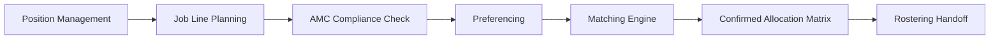
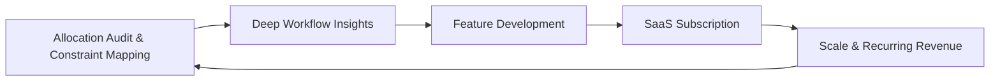

import { FrameworkCard, MatrixGrid, StrategicPillar } from
'@site/src/components/BusinessPlanning';

# What We Do

**We replace spreadsheets and guesswork with mathematically rigorous,
transparent medical workforce allocation.**

---

## The Problem We Solve

Every Australian hospital runs on rotations — fixed blocks of clinical
experience that move through the year. Every year, Medical Workforce teams
allocate hundreds (sometimes thousands) of doctors to these blocks. The current
process is:

- **Manual and fragile:** Spreadsheet-based allocation consumes thousands of
  administrative hours and fails unpredictably when constraints change.
- **Opaque and distrusting:** Doctors receive allocations without explanation,
  perceive bias, and lose trust in their employer.
- **Non-compliant by design:** The 2024 AMC Prevocational Framework introduces
  stricter clinical experience requirements that manual systems cannot reliably
  track or audit.

The human cost is real — post-COVID burnout rates in junior doctors have risen
to 55%, with "lack of control" and "opaque administrative processes" cited as
primary drivers of attrition from the public system.

---

## The Solution: Receptor

Receptor is a **comprehensive allocation suite** that manages the full rotation
lifecycle — from planning the annual job line structure through to confirming
each doctor's placement.

### The Four Applications

<MatrixGrid columns={2}>
  <FrameworkCard title="Workforce App" icon="👥">
    <strong>Master data management.</strong>
    
Manage teams, locations, positions, and staff profiles. The foundation that all allocation activities draw from.

  </FrameworkCard>
  <FrameworkCard title="Planner App" icon="🗺️">
    <strong>Job line construction.</strong>
    
Configure rotation timelines, validate clinical experience coverage against AMC requirements, and build the annual job line structure.

  </FrameworkCard>
  <FrameworkCard title="Preferencer App" icon="📱">
    <strong>Doctor-facing preference submission.</strong>
    
Mobile-first, 5-level preference system for transparent trainee input. Doctors submit preferences; the system guarantees they are heard.

  </FrameworkCard>
  <FrameworkCard title="Allocator" icon="⚙️">
    <strong>The matching engine.</strong>
    
Our core IP. A constraint-driven optimisation algorithm (Google OR-Tools) that resolves preferences against operational constraints to produce a mathematically optimal, fully auditable allocation.

  </FrameworkCard>
</MatrixGrid>

:::note[Scope Boundary]
**Receptor begins where onboarding ends.** Recruitment, credentialing, and payroll are out of scope — these are handled by HR teams before a doctor enters the allocation workflow. See [Scope & Boundaries](../strategy/strategy-vision/scope) for the full boundary matrix.
:::
:::

---

## Our Delivery Model

Common Bond operates on a **Hybrid SaaS + Consulting** model — a deliberate
flywheel designed to keep the software grounded in clinical reality while
building recurring revenue.

### How It Works in Practice

1. **Consulting engagement first:** We begin with an _Allocation Audit_ — a paid
   workshop where we map the client's constraints, current processes, and
   workforce data. This is paid R&D.
2. **Platform delivery:** Receptor is configured for the client's specific
   rotation structure. The consulting phase eliminates the implementation risk
   that sinks generic software deployments.
3. **SaaS subscription:** Once the first allocation cycle is complete, clients
   transition to an annual SaaS subscription — predictable recurring revenue for
   Common Bond, a dramatically lower cost than the consulting engagement for the
   client.

---

## What's Coming Next

| Capability                   | Timeframe | Description                                                     |
| :--------------------------- | :-------- | :-------------------------------------------------------------- |
| **Rotation Swap Management** | FY2027–28 | Structured swap requests between doctors with approval workflow |
| **Certificates of Service**  | FY2027–28 | Automated end-of-term documentation for completed rotations     |
| **Rostering Integration**    | FY2029+   | API feeds to HealthRoster/Kronos for daily shift scheduling     |

---

:::tip[Deeper Reading]
- [Vision & Future Roadmap](../strategy/strategy-vision/vision) — long-term ambition for Receptor beyond junior doctors
- [Our Aims](./our-aims) — specific 1yr, 3yr, and 10yr targets
- [Why Now?](../strategy/strategy-vision/why-now) — the market forces making this essential right now
:::
:::
