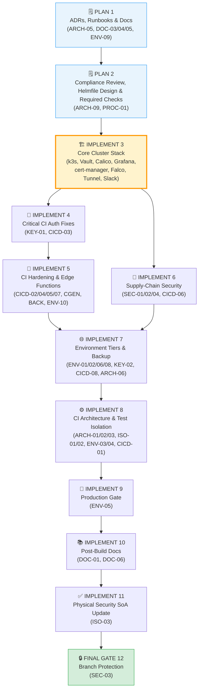
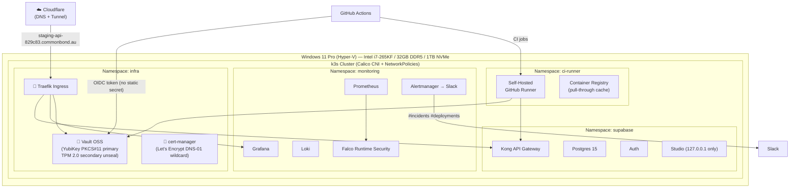
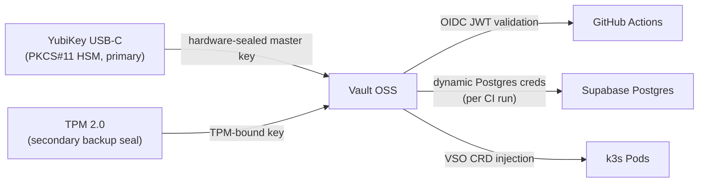

# CI/CD Infrastructure & Environment Architecture Audit

**Date:** 2026-03-12\
**Scope:** All repositories — `supabase-receptor`, `preference-frontend`, `planner-frontend`, `workforce-frontend`, `backend/receptor-planner`, `backend/match-backend`\
**Auditor:** Ryan Ammendolea\
**Standard:** ISO 27001 A.8.31 (separation of dev/test/prod), A.8.9 (configuration management), A.8.25 (secure development lifecycle)

---

## Executive Summary

**57 findings across 6 repositories and cross-ecosystem CI infrastructure.** The ecosystem's CI/CD pipeline has three compounding structural deficiencies: (1) all Supabase-dependent CI jobs boot an independent ephemeral instance per job with no sharing, consuming approximately 4 minutes of runner time per boot and 12+ minutes per frontend push; (2) a hard Supabase API key format incompatibility between the new `sb_publishable_*` format (used by REST/GraphQL) and the legacy JWT `ANON_KEY` (required by `signInWithPassword`) is undocumented and creates invisible auth failures if the dual-key export workaround is removed; and (3) all three frontend repos pin `version: latest` for the Supabase CLI, creating schema-drift false positives when the upstream CLI changes its output formatting. Beyond CI, no test, staging, or production environment is documented or deployed — only a single dev instance exists. **A new strategic opportunity has been identified**: the available Windows 11 Pro machine (Intel i7-265KF 20-core, 32 GB DDR5, 1 TB NVMe, RTX 5080) with Hyper-V support is capable of running a `k3s`-based Kubernetes cluster that would fundamentally resolve the CI/CD boot-time and isolation problems at the infrastructure level.

| Repository / Area | Coverage | Issues Found | Overall |
| --- | --- | --- | --- |
| `preference-frontend` CI | ✅ | 5 | ⚠️ Partially compliant |
| `planner-frontend` CI | ⚠️ | 6 | ❌ Non-compliant |
| `workforce-frontend` CI | ⚠️ | 5 | ❌ Non-compliant |
| `supabase-receptor` CI | ❌ | 3 | ❌ Non-compliant |
| `match-backend` CI | ⚠️ | 2 | ❌ Non-compliant |
| `receptor-planner` CI | ❌ | 2 | ❌ Non-compliant |
| Environment Tiers | ❌ | 4 | ❌ Critical gap |
| Key Format Migration | ❌ | 1 | 🔴 Critical/Deadline passed |
| CI/CD Architecture Strategy | ⚠️ | **NEW** | 🟢 Strategic Opportunity |

---

## 1. Environment Tiers

### 1.1 Documented Environment Tier Status

**Strengths:**

- `setup.sh` accepts `--env dev|test|staging|prod` and correctly differentiates secret injection behaviour per tier.
- `RESET_setup.sh` provides a clean teardown mechanism to complement provisioning.
- The VM operations runbook (`docs/operations/vm-setup.md`) is comprehensive for initial server setup.

**Gaps:**

- [ENV-01] `docs/infrastructure/environment/supabase-self-hosted.md` and `specs.md` document only a single dev environment. No `test`, `staging`, or `prod` tier is instantiated or documented anywhere in the repository.
- [ENV-02] `setup.conf.example` lacks any template for non-dev tiers. All URLs are hardcoded to `localhost:8000`/`localhost:3000`, with no placeholder pattern for test/staging sub-domain URLs or port offsets.
- [ENV-03] `RESET_setup.sh` uses `read -p` (interactive prompt) and cannot be invoked non-interactively by a CI runner. There is no `--yes` / `--force` flag.
- [ENV-04] No `pg_cron` job exists to purge stale test organisations (i.e. `__test_*` naming convention) from the shared test/staging instance. Test data accumulates indefinitely.

---

## 2. Supabase CI Boot Architecture (Cross-Ecosystem)

### 2.1 Duplicate Supabase Boots per PR

**Strengths:**

- All three frontend repos correctly isolate DB-free unit tests from Supabase-dependent jobs — preventing unnecessary boots for lint/type/unit workloads.
- `preference-frontend` successfully implemented the dual-key export workaround (JWT + publishable key in separate env vars).

**Gaps:**

- [CICD-01] Each frontend repo runs **3 independent Supabase boots** per CI trigger (`integration-tests`, `codegen-check`, `e2e-axe`), each taking ~4 minutes. A single 3-repo push creates up to 9 parallel Supabase boot events and ≥36 minutes of aggregate runner time, not counting queue time.
- [CICD-02] All three frontend repos use `version: latest` for `supabase/setup-cli@v1` (`planner-frontend/.github/workflows/ci.yml:82`, `workforce-frontend/.github/workflows/ci.yml:79`, `preference-frontend/.github/workflows/ci.yml:123`). The Supabase CLI is not version-pinned, meaning any upstream CLI breaking change silently propagates without warning.

### 2.2 Service Role Key Handling

**Gaps:**

- [CICD-03] `planner-frontend/.github/workflows/ci.yml:105` and `workforce-frontend/.github/workflows/ci.yml:102` pass `SUPABASE_SERVICE_ROLE_KEY: ${{ secrets.LOCAL_SUPABASE_SECRET_KEY }}` — a hardcoded GitHub Secret — rather than extracting the dynamically generated key from the running CI instance via `supabase status`. This means the key used is the developer's local dev key, not the ephemeral CI instance key. If the local dev key rotates or differs, integration tests will silently fail auth.
- [CICD-04] `supabase-receptor/.github/workflows/ci.yml:27` runs `supabase start --ignore-health-check` with no `--workdir` flag, meaning it starts against whatever `supabase/config.toml` is found at the invocation directory. The step is fragile to CWD assumptions and any future directory restructure.

---

## 3. Supabase Key Format Migration

### 3.1 JWT vs. Publishable Key Incompatibility

**Strengths:**

- `preference-frontend` correctly exports both `NEXT_PUBLIC_SUPABASE_ANON_KEY` (publishable, for REST/GraphQL) and `NEXT_PUBLIC_SUPABASE_ANON_JWT` (legacy JWT, for `signInWithPassword`) in `.github/workflows/ci.yml:138-143`.

**Gaps:**

- [KEY-01] Supabase migrated from JWT-based keys (`eyJ...`) to `sb_publishable_*` / `sb_secret_*` format with a **hard deadline of October 1, 2025** (already passed). `planner-frontend` and `workforce-frontend` CI jobs do not export `ANON_JWT` — any test that calls `signInWithPassword()` will silently receive an `sb_publishable_*` key that is rejected by the GoTrue auth endpoint. The `globalSetup` files for these repos have not been audited against this requirement.
- [KEY-02] `key-management.md:33-40` references `npx supabase status` as the way to retrieve `ANON_KEY` and `SERVICE_ROLE_KEY`, using the old key names. The document predates the publishable key migration and does not reflect that `ANON_KEY` is now the legacy JWT and `PUBLISHABLE_KEY` is the new public key. The documentation is actively misleading.

---

## 4. GraphQL Codegen CI Gate

### 4.1 Codegen Gate Standardisation

**Strengths:**

- `preference-frontend` uses the correct `git diff --exit-code` pattern instead of `--check`, avoiding false positives from CLI-version formatting noise (`preference-frontend/.github/workflows/ci.yml:228-233`).

**Gaps:**

- [CGEN-01] `planner-frontend/.github/workflows/ci.yml:180` runs `npx graphql-codegen --config codegen.check.ts --check`. The `--check` flag performs an in-memory comparison that does not account for `postcodegen` hook patching (the `// @ts-nocheck` header prepended by `package.json`). This produces false-positive "drift" failures on any run where the hook-patched committed file differs from the in-memory unpatched output.
- [CGEN-02] `workforce-frontend/.github/workflows/ci.yml:172` has the same `--check` defect as planner. Both repos should adopt the `regenerate + git diff` pattern already implemented in `preference-frontend`.

---

## 5. Branch-Matched Ephemeral Environments

### 5.1 Architecture Gap

**Gaps:**

- [ARCH-01] No branch-matched ephemeral Supabase environment strategy exists. Every CI run uses a cold-boot ephemeral instance and tears it down after the run. There is no mechanism to reuse a running test instance across related jobs in the same workflow, nor across concurrent PRs.
- [ARCH-02] The self-hosted Supabase provisioning script (`setup.sh`) has no CI-native invocation mode. It requires interactive prompts for staging/prod, uses `python3 -c yaml` inline patching (requiring PyYAML on the host), and has no idempotent "ensure instance is running" fast-path for CI use.
- [ARCH-03] No self-hosted GitHub Actions runner is configured on the same VM hosting the Supabase dev instance. All CI jobs use GitHub-hosted `ubuntu-latest` runners, which cannot share the Docker daemon with the self-hosted Supabase stack. This makes branch-matched Docker-network ephemeral instances infeasible without a runner co-location change.

---

## 6. Test Data Isolation

### 6.1 Namespacing and Cleanup

**Gaps:**

- [ISO-01] No test organisation namespacing convention is specified or enforced. All three frontend repos use the same `TEST_ADMIN_EMAIL`/`TEST_WORKER_EMAIL` GitHub Secrets, meaning concurrent CI runs from different branches on the same instance could create or modify the same test data.
- [ISO-02] The seed data (`seed_acacia.sql`) and test credentials (`test_user_credentials.json`) are configured for a single shared "Acacia Enterprises" org with no run-ID isolation mechanism.

---

## 7. Documentation and Cross-Repo Consistency

### 7.1 Infrastructure Documentation Gaps

**Gaps:**

- [DOC-01] `docs/infrastructure/security/key-management.md:86-88` has an open `TODO` block for integrating Bitwarden/Doppler CLI into the deployment workflow. This was identified in the initial specifications but has never been actioned — there is no secrets vault integration.
- [DOC-02] No runbook exists for promoting a change through dev → test → staging → prod. The `setup.sh` supports the `--env` flag but there is no documented promotion workflow, rollback procedure, or migration gate.

---

## 8. Backend Repo CI

### 8.1 match-backend

**Strengths:**
- Has a CI pipeline (`match-backend/.github/workflows/ci.yml`). Unit tests are explicitly scoped to `allocator/tests/unit/` with `-m 'not slow'`, correctly avoiding slow tests in CI.
- Uses a `python:3.11-slim` container — clean, reproducible, dependency-free.

**Gaps:**
- [BACK-01] `match-backend` has no integration test job. `test_supabase_integration.py` is skipped in CI via `pytest.mark.skipif` guard when stub env vars are detected. This means the Supabase-dependent integration tests are never run in CI — they rely entirely on developer discipline to run locally.
- [BACK-02] Both `match-backend` and `receptor-planner` set `SUPABASE_SERVICE_ROLE_KEY` to a hardcoded placeholder JWT string (`eyJhbGciOiJIUzI1NiIsInR5cCI6IkpXVCJ9.eyJzdWIiOiIxMjM0NTY3ODkwIiwi...`). While this is intentionally non-functional (it triggers the skipif guard), it leaks a test JWT pattern into the repo that could be mistaken for a real credential by static analysis scanners.

### 8.2 receptor-planner

**Gaps:**
- [BACK-01] `receptor-planner/.github/workflows/ci.yml` runs bare `pytest` with no path scoping. This runs *all* discovered test files including any future integration tests, with stub env vars. There is no `unit` project or `-m unit` selector — any inadvertent integration test addition will run against stub URLs and silently pass or produce misleading failures.
- [BACK-02] Same hardcoded JWT placeholder in `SUPABASE_SERVICE_ROLE_KEY` as match-backend.

---

## 9. Strategic Architecture: Kubernetes-Class CI/CD

### 9.1 Kubernetes Cluster Opportunity (Windows 11 Pro + Hyper-V)

The available Windows 11 Pro workstation (Intel i7-265KF — 8 P-cores + 12 E-cores = 20 cores, 32 GB DDR5-6000, 1 TB Kingston NVMe) with native Hyper-V support represents a significant infrastructure opportunity. A lightweight Kubernetes cluster (`k3s` or `k3d`) deployed across Hyper-V VMs would fundamentally resolve all three CI/CD architectural deficiencies (CICD-01, ARCH-01, ARCH-03) at the infrastructure level.

**Recommended Architecture — k3s on Hyper-V:**

```
┌─────────────────────────────────────────────────────┐
│ Windows 11 Pro Host (i7-265KF 20c, 32 GB DDR5)     │
│  Hyper-V Hypervisor                                  │
│                                                      │
│  ┌──────────────────────────────────────────────┐   │
│  │  Ubuntu Server VM — k3s Control Plane        │   │
│  │  4 cores, 6 GB RAM                           │   │
│  │  - GitHub Actions Runner (self-hosted)       │   │
│  │  - Cert Manager / Traefik ingress            │   │
│  └──────────────────────────────────────────────┘   │
│                                                      │
│  ┌──────────────────────────────────────────────┐   │
│  │  Ubuntu Server VM — k3s Worker Node 1        │   │
│  │  6 cores, 10 GB RAM                          │   │
│  │  - Supabase dev namespace (persistent)       │   │
│  │  - Supabase staging namespace (persistent)   │   │
│  └──────────────────────────────────────────────┘   │
│                                                      │
│  ┌──────────────────────────────────────────────┐   │
│  │  Ubuntu Server VM — k3s Worker Node 2        │   │
│  │  6 cores, 10 GB RAM                          │   │
│  │  - Branch CI namespaces (ephemeral)          │   │
│  │  - receptor-ci-<branch-slug> namespaces      │   │
│  └──────────────────────────────────────────────┘   │
└─────────────────────────────────────────────────────┘
```

**Key Benefits:**

1. **Namespace-per-branch CI isolation** — each feature branch gets its own `receptor-ci-<slug>` Kubernetes namespace with a dedicated Supabase pod, Postgres PVC, and ephemeral lifecycle.
2. **Shared container image pull cache** — Supabase Docker images (~3 GB) are pulled once and cached in the cluster's container registry. Branch instances start from cached layers, reducing boot time from ~4 min to ~30–60 sec.
3. **Ingress reverse proxy** — a Traefik/nginx ingress controller can route `<branch>.ci.commonbond.local` to the correct namespace, solving the URL-per-branch problem without port juggling.
4. **Persistent named environments** — dev and staging are just named namespaces with persistent PVCs. Promotion from CI → staging is a `kubectl apply` with the staging namespace config.
5. **No Docker-in-Docker issues** — pods run natively on the k3s containerd runtime; no privileged containers or DinD required.
6. **RTX 5080 available for future ML workloads** — the GPU is accessible via device plugin if the match-backend allocator adopts GPU-accelerated work.

**Feasibility on available hardware:**

| Resource | Available | Required (3-VM k3s) | Headroom |
| --- | --- | --- | --- |
| CPU cores | 20 (8P+12E) | 16 | 4 free |
| RAM | 32 GB | 26 GB | 6 GB free |
| NVMe storage | 1 TB | ~100 GB | 900 GB free |
| Network | 1x NIC | 1x NIC (Hyper-V vSwitch) | ✅ |

**Recommended tooling:**
- `k3s` v1.x (lightweight, single-binary Kubernetes, excellent for homelab/mini-cloud)
- `Helm` for deploying Supabase (community Helm chart exists)
- `Traefik` (bundled with k3s) as ingress controller
- `cert-manager` for automatic TLS on dev subdomains via Cloudflare DNS-01 challenge
- GitHub Actions self-hosted runner as a Deployment in the control plane VM

**Gaps (ARCH-04):**
- [ARCH-04] No Kubernetes cluster exists. This finding captures the recommendation to evaluate and implement a k3s cluster on the Windows 11 Pro machine as the strategic long-term CI/CD infrastructure. The current Docker Compose-based setup should continue as an intermediate state while the cluster is designed and provisioned.

---

## 10. Cross-Cutting Observations

1. **Reference implementation exists**: `preference-frontend` CI is the most advanced — dual-key export, `git diff` codegen gate, `tr -d '"'` quote-stripping. It should be the canonical reference for upgrading planner and workforce frontends.
2. **`supabase-receptor` CI is the thinnest**: Runs `supabase start` with no workdir, no key extraction, no job dependencies, and no CLI pinning.
3. **`receptor-planner` CI is the weakest overall**: Bare `pytest` with no path scoping, no coverage, and hardcoded JWT stubs. Oldest CI file in the ecosystem.
4. **Kubernetes cluster is the strategic long-term solution**: The available hardware (32 GB DDR5, 20-core i7-265KF, Windows 11 Pro + Hyper-V) makes a k3s cluster viable with comfortable headroom. ARCH-04 resolves CICD-01, ARCH-01, ARCH-02, and ARCH-03 structurally.
5. **Homelab-as-production is a deliberate architectural choice**: The Windows 11 Pro machine is on the same power grid as a tertiary hospital, served by 500/50 Mbps fibre. Hosting production here until meaningful customer scale is a rational cost decision for a single-operator startup — the operational complexity is correctly offset by the k3s cluster's Vault/YubiKey/Calico/Falco hardening stack.
6. **SEC-08 (RBAC) and SEC-09 (pgaudit) are elevated**: k3s RBAC defaults expose cluster-admin to all pods; pgaudit is the only tamper-resistant forensic trail for production DDL/DML. Both are High severity — do not defer past Phase 3 and Phase 7 respectively.
7. **CICD-09 composite action is the structural fix for drift**: KEY-01 and CICD-02 were caused by maintaining 4 copies of the same CI pattern. A shared composite action at `supabase-start` eliminates the source of drift permanently.

---

## Severity Summary

| Finding ID | Repository / Area | File | Category | Severity |
| --- | --- | --- | --- | --- |
| CICD-01 | All frontend repos | `.github/workflows/ci.yml` (all 3) | Architectural Drift | 🟠 High |
| CICD-02 | All frontend repos | `.github/workflows/ci.yml` (all 3) | Tech Debt | 🟠 High |
| CICD-03 | planner, workforce | `ci.yml:105`, `ci.yml:102` | Security | 🟠 High |
| CICD-04 | supabase-receptor | `.github/workflows/ci.yml:27` | Tech Debt | 🟡 Medium |
| KEY-01 | planner, workforce | `ci.yml` (globalSetup not audited) | Security | 🔴 Critical |
| KEY-02 | supabase-receptor | `docs/infrastructure/security/key-management.md` | Documentation Gap | 🟡 Medium |
| CGEN-01 | planner-frontend | `.github/workflows/ci.yml:180` | Architectural Drift | 🟡 Medium |
| CGEN-02 | workforce-frontend | `.github/workflows/ci.yml:172` | Architectural Drift | 🟡 Medium |
| ARCH-01 | Cross-ecosystem | — | Process Gap | 🟠 High |
| ARCH-02 | supabase-receptor | `utils/setup.sh` | Process Gap | 🟠 High |
| ARCH-03 | Cross-ecosystem | — | Process Gap | 🟠 High |
| ENV-01 | supabase-receptor | `docs/infrastructure/environment/` | Documentation Gap | 🟠 High |
| ENV-02 | supabase-receptor | `setup.conf.example` | Process Gap | 🟡 Medium |
| ENV-03 | supabase-receptor | `utils/RESET_setup.sh` | Process Gap | 🟡 Medium |
| ENV-04 | supabase-receptor | `supabase/` (missing) | Process Gap | 🟡 Medium |
| ISO-01 | All frontend repos | `ci.yml` (all 3) | Process Gap | 🟡 Medium |
| ISO-02 | supabase-receptor | `seed_acacia.sql`, `test_user_credentials.json` | Process Gap | 🟡 Medium |
| BACK-01 | match-backend, receptor-planner | `.github/workflows/ci.yml` (both) | Process Gap | 🟡 Medium |
| BACK-02 | match-backend, receptor-planner | `.github/workflows/ci.yml` (both) | Security | 🟡 Medium |
| ARCH-04 | cross-ecosystem | — | Strategic Opportunity | 🟢 Strategic/High-Value |
| DOC-01 | supabase-receptor | `docs/infrastructure/security/key-management.md` | Documentation Gap | 🟢 Low |
| DOC-02 | supabase-receptor | `docs/operations/` (missing) | Documentation Gap | 🟡 Medium |
| DOC-03 | supabase-receptor | `docs/infrastructure/environment/` (missing) | Documentation Gap | 🟢 Low |
| SEC-01 | Cross-ecosystem | `.github/workflows/ci.yml` (all 5) | Security | 🟡 Medium |
| SEC-02 | Cross-ecosystem | `.github/workflows/ci.yml` (all 5) | Security | 🟡 Medium |
| CICD-05 | Cross-ecosystem | `.github/workflows/ci.yml` (all 5) | Process Gap | 🟡 Medium |
| ENV-05 | supabase-receptor | `.github/workflows/` (missing) | Compliance | 🟡 Medium |
| ARCH-05 | supabase-receptor | `docs/adr/` (missing) | Documentation Gap | 🟡 Medium |
| SEC-03 | Cross-ecosystem | — | Security | 🟙 High (deferred to Phase 10) |
| CICD-06 | Cross-ecosystem | `.github/dependabot.yml` (all 6) | Tech Debt | 🟡 Medium |
| ISO-03 | cross-ecosystem/supabase-receptor | `docs/compliance/iso27001/operations/soa.md` | Compliance | 🟡 Medium |
| ENV-06 | supabase-receptor | `docs/infrastructure/security/key-management.md` | Process Gap | 🟡 Medium |
| PROC-01 | Cross-ecosystem | `docs/operations/ci-required-checks.md` (missing) | Process Gap | 🟡 Medium |
| ENV-07 | supabase-receptor | Cloudflare Tunnel (not provisioned) | Process Gap | 🟙 High |
| ARCH-06 | supabase-receptor | k3s container registry (missing) | Strategic Opportunity | 🟡 Medium |
| DOC-04 | supabase-receptor | `docs/operations/ci-troubleshooting.md` (missing) | Documentation Gap | 🟢 Low |
| SEC-04 | supabase-receptor | `docker-compose.yml` image refs | Security | 🟡 Medium |
| ARCH-07 | supabase-receptor | k3s observability stack (missing) | Strategic Opportunity | 🟡 Medium |
| ENV-08 | supabase-receptor | Cloudflare R2 backup (missing) | Process Gap | 🟡 Medium |
| SEC-05 | supabase-receptor | Supabase Studio port binding | Security | 🟡 Medium |
| DOC-05 | supabase-receptor | `docs/infrastructure/disaster-recovery.md` (missing) | Documentation Gap | 🟢 Low |
| ARCH-08 | supabase-receptor | Calico CNI / NetworkPolicies (missing) | Security | 🟡 Medium |
| ARCH-09 | supabase-receptor | `k3s/helmfile.yaml` (missing) | Tech Debt | 🟡 Medium |
| ENV-09 | supabase-receptor | `docs/operations/promotion-runbook.md` (missing) | Process Gap | 🟡 Medium |
| SEC-06 | supabase-receptor | Vault unseal key storage | Security | 🟠 High |
| DOC-06 | supabase-receptor | `docs/ONBOARDING.md` (missing) | Documentation Gap | 🟢 Low |
| CICD-07 | Cross-ecosystem | `actions/cache` (missing in all ci.yml) | Tech Debt | 🟡 Medium |
| ARCH-10 | supabase-receptor | cert-manager + wildcard TLS (DNS-01) | Strategic Opportunity | 🟡 Medium |
| CICD-08 | Cross-ecosystem | GitHub Environments (not configured) | Process Gap | 🟡 Medium |
| SEC-07 | supabase-receptor | Falco runtime security (missing) | Security | 🟡 Medium |
| ENV-10 | supabase-receptor | Edge Function versioning & rollback | Process Gap | 🟠 High |
| PROC-02 | supabase-receptor | Incident response plan + Slack alerts | Process Gap | 🟡 Medium |
| SEC-08 | supabase-receptor | k3s RBAC — no least-privilege ServiceAccounts | Security | 🟠 High |
| OPS-01 | supabase-receptor | Windows 11 host OS update & reboot recovery | Process Gap | 🟡 Medium |
| SEC-09 | supabase-receptor | Supabase `pgaudit` extension not enabled | Security | 🟠 High |
| ENV-11 | supabase-receptor | R2 backup — no secondary Australian provider copy | Process Gap | 🟡 Medium |
| CICD-09 | Cross-ecosystem | No composite action for Supabase start + key extraction | Tech Debt | 🟡 Medium |

---

## Implementation Roadmap

:::danger
**Phase 3 (Core Cluster) is the critical path for this entire audit.** All subsequent implementation phases depend on the k3s cluster being operational with Vault, Calico, and Grafana/Alertmanager running. Phases 1-2 (PLAN) must be completed before Phase 3 begins.
:::

:::info
This audit uses a **two-phase model**: `PLAN` phases produce documents and architecture decisions with no system changes. `IMPLEMENT` phases make actual infrastructure or CI changes. This ensures all design decisions are captured in ADRs and runbooks before any provisioning begins.
:::

### Phase Dependency Flowchart



### k3s Cluster Architecture



### Vault Unseal Architecture

:::caution
**The Vault root token must never be stored digitally.** Write it on paper, place it in a sealed envelope in a physically secured location, and document the location in the DR plan (DOC-05) — not in git.
:::



:::tip
**For agents continuing this audit:** The `latestHandover` field in `audit-brief.json` always contains the state summary. The `implementationPhases[]` array in `recommendations.json` is the authoritative source for what belongs in each phase. Always run `validate-recommendations.py` before committing.
:::
