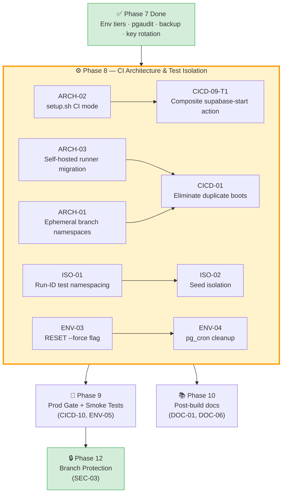
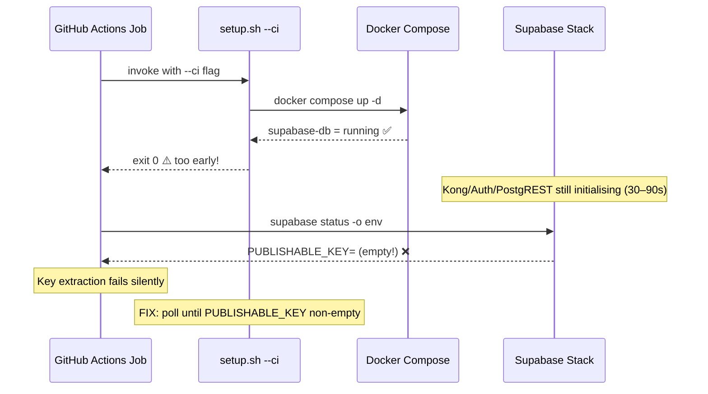
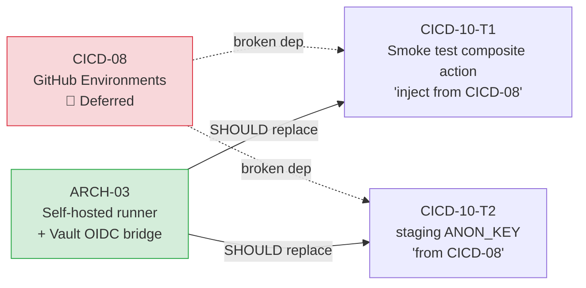
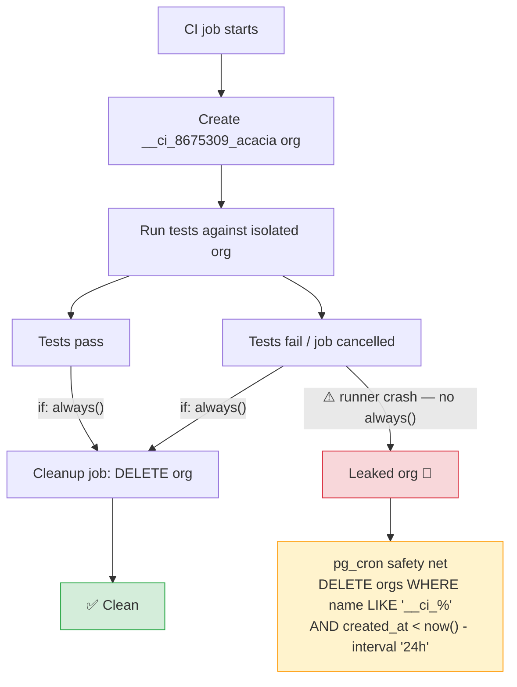
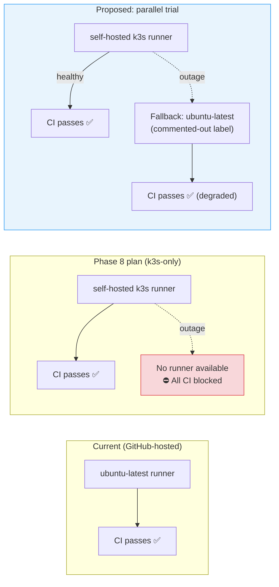

# Pre-Phase-8 Audit Review — 260312-cicd-environments
**State:** 7 sessions complete · 34 open tasks · Phases 1–7 done · Phase 8 next\
**Review date:** 2026-03-13

---

## Phase 8 Dependency Map



## Context

Phases 1–7 delivered: ADRs, helmfile, CI required-check matrix, full k3s cluster
stack (Vault/Calico/Falco/cert-manager/Alertmanager), CI auth fixes, pipeline
hardening, supply-chain security (SHA pins, Dependabot, Renovate), environment
tiers, backup dual-provider topology, pgaudit, and key rotation infrastructure.

Phase 8 is the most architecturally complex remaining phase: `ARCH-01`, `ARCH-02`,
`ARCH-03`, `CICD-01`, `ENV-03`, `ENV-04`, `ISO-01`, `ISO-02` — the transition
from GitHub-hosted runners to the self-hosted k3s runner, test isolation, and the
`setup.sh` CI-native invocation mode.

---

## 🔴 Five Critical Gaps

### GAP-1 — `setup.sh` CI Mode Does Not Validate the Supabase Stack (Health Check Misfire)

`setup.sh --ci` exits 0 as soon as `supabase-db` reaches `running` (line 377) —
but `running` is a Docker Compose *process* state, not a Supabase-ready state.
The Kong API gateway, GoTrue auth, and PostgREST can still be initialising for
30–90 seconds after `supabase-db` is running. Any CI job that immediately calls
`supabase status -o env` to extract keys (per ARCH-02's planned CI-native mode)
will race against this window and receive an empty or partial key output.

:::caution
This gap affects every finding in Phase 8. `ARCH-02-T1` (CI-native setup.sh
invocation) and `CICD-09-T1` (composite action key extraction) both assume
`setup.sh --ci` exits ready-to-use. If the health gate stays at process-level,
both implementations will be intermittently flaky in ways that are very hard to
diagnose in GitHub Actions logs.
:::

**Fix:** The `--ci` health loop (lines 373–388) must poll `supabase status -o env`
until `PUBLISHABLE_KEY` is non-empty — not `docker compose ps`. The existing
`--ignore-health-check` workaround in `ci.yml` confirms this is a known issue,
but `ARCH-02` doesn't capture it as a required change to `setup.sh`.



---

### GAP-2 — `CICD-08` Was Accepted-and-Closed but Its Dependent Tasks in `CICD-10` Are Still Open

`CICD-08` (GitHub Environments) was deferred because Vault supersedes its
secret-scoping function — the `completedAt` timestamp on `CICD-08-T1` records
it as done on 2026-03-12. However, `CICD-10-T1` and `CICD-10-T2` explicitly
reference `CICD-08` **as a prerequisite**:

- `CICD-10-T1`: *"slack-webhook-url (injected from Vault via CICD-08
  environment)"*
- `CICD-10-T2`: *"the staging ANON_KEY from the 'staging' GitHub Environment
  (CICD-08)"*

If GitHub Environments are not created, the smoke-test composite action has no
mechanism to receive environment-scoped secrets. Vault can inject secrets into
k3s pods, but GitHub Actions jobs on GitHub-hosted runners cannot reach the
self-hosted Vault without the OIDC bridge that is only wired in Phase 8 (ARCH-03).

:::caution
`CICD-10` (Phase 9) is currently unimplementable without either GitHub
Environments or the Phase 8 OIDC runner bridge being in place. The clarification
that deferred CICD-08 did not update CICD-10's task descriptions, leaving a
broken dependency chain in `recommendations.json`.
:::

**Fix:** Add a clarification to `recommendations.json` for CICD-10 specifying
that the smoke test's secret injection mechanism switches from GitHub Environment
secrets to Vault OIDC injection (via the self-hosted runner's Vault token
established in ARCH-03). Update CICD-10 task descriptions to remove the
`(CICD-08)` parentheticals.



---

### GAP-3 — `ISO-01` and `ISO-02` (Test Isolation) Have No Specified Cleanup Trigger

`ISO-01` requires run-ID namespacing for test orgs; `ISO-02` requires seed data
isolation. Neither finding specifies *who triggers cleanup* of the namespaced test
data:

- If the cleanup is a post-job step in the GitHub Actions workflow, it won't
  run if the job is cancelled or the runner crashes.
- If it's the `pg_cron` job from `ENV-04`, the cron job doesn't know which
  `__ci_<run-id>_*` org names to target — it can only match a naming pattern.
- There is no `always()` post-step in any of the current `ci.yml` files.

:::info
Without a reliable cleanup trigger, test orgs accumulate across cancelled/timed-
out CI runs — exactly the failure mode `ENV-04` aims to prevent. The `ISO-01`
and `ISO-02` task descriptions say *what* to create but not *when* to delete it.
:::

**Fix:** `ISO-01-T1` should explicitly specify cleanup using a GitHub Actions job
with `if: always()` that calls `supabase db execute` to delete the run-ID-scoped
org. `ENV-04`'s `pg_cron` job becomes the safety net for leaked orgs only (orgs
older than 24 hours matching `__ci_%`), not the primary cleanup mechanism.



---

### GAP-4 — `ARCH-03` (Self-Hosted Runner) Has No Rollback Strategy if k3s Is Unstable

`ARCH-03` migrates all CI jobs to the self-hosted runner co-located on k3s.
Phase 3 (`ARCH-04`) created the k3s cluster, but the cluster has never processed
production CI load. The comprehensive_review.md correctly identifies ARCH-04 as
the single critical-path risk — but no finding or task documents what happens if:

- The self-hosted runner pod crashes mid-PR
- The k3s control plane is unhealthy during a time-sensitive hotfix
- The Cloudflared tunnel that the runner uses to reach GitHub goes down

With GitHub-hosted runners removed, every repository would be completely unable
to run CI until the cluster recovers.

:::caution
Phase 8 currently plans to switch to k3s runners without a parallel-run safety
period. There is no task to run GitHub-hosted and self-hosted runners *in
parallel* for a trial window, nor any fallback label configuration that routes
to `ubuntu-latest` if the self-hosted runner is offline.
:::

**Fix:** Add a pre-Phase-8 task to configure each `ci.yml` with
`runs-on: [self-hosted, k3s]` with a runner-group fallback label, and set
`continue-on-error: false` with a Slack alert on runner unavailability. The full
switch to k3s-only should be gated on 7 consecutive clean CI runs — not flipped
in a single commit.



---

### GAP-5 — `PROC-01-T2` (Check Matrix Refresh) Was Recommended in [comprehensive_review.md](./comprehensive_review) But Never Created

The existing [comprehensive_review.md](./comprehensive_review) (Section 5, Resolution #1) explicitly
recommended creating `PROC-01-T2`:

> *"Add a `PROC-01-T2` task: After Phase 5 CI hardening, review and update the
> required check matrix for any new or renamed jobs before Phase 12 branch
> protection is enabled."*

`PROC-01` has status `complete` with only `PROC-01-T1` — the Phase 2 check
matrix document was written before Phases 4 and 5 added new CI jobs (integration-
tests job for BACK-01, the composite action renaming in CICD-09). The `PROC-01-T2`
task recommended by the prior review was never added to `recommendations.json`.

:::caution
Phase 12 (`SEC-03` branch protection) will configure required status checks
using the current matrix. If the matrix is stale, branch protection will either
miss required checks (security gap) or block on renamed/removed checks that no
longer exist (CI deadlock). This is a latent compliance failure that will only
become visible at the most inconvenient moment — during Phase 12 activation.
:::

**Fix:** Add `PROC-01-T2` to `recommendations.json` under `PROC-01` (status:
`open`, Phase 11): *"Audit `ci-required-checks.md` against all current job names
across 6 repos after Phase 5/8/9 CI changes. Update the matrix to match. This
document is the direct input to SEC-03 (Phase 12) branch protection ruleset."*

---

## 🟢 Five Critical Enhancements

### ENH-1 — Establish a Phase 8 Dry-Run Protocol Before Any Runner Migration

Phase 8 changes are the highest risk in the entire audit — they touch the CI
infrastructure of every repository simultaneously and depend on the k3s runner
being operational. A dry-run protocol would materially de-risk execution:

**Proposed addition to `audit-brief.json` / Phase 8 session opening:**
1. Before writing any code, run `kubectl get nodes` and `kubectl get pods -n ci-runner` to confirm runner pod is `Running`.
2. Test the runner with a no-op workflow on a single repo (a `workflow_dispatch` that runs `echo "runner online"`).
3. Only proceed with CI migrations if the no-op succeeds with `<30s` end-to-end.
4. Keep `runs-on: ubuntu-latest` in a commented-out fallback block in every `ci.yml` during Phase 8 — remove only after 7 clean runs.

This is a workflow-level enhancement to `/implement-global-audit.md` that would
benefit any future phase involving infrastructure changes.

---

### ENH-2 — Add `CICD-09` (Composite Action) as a Phase 8 Prerequisite, Not Phase 9

`CICD-09` (the shared `supabase-start` composite action) is currently in Phase 9.
But `ARCH-02-T1` (Phase 8) requires a CI-native invocation of `setup.sh` that
extracts Supabase keys — which is precisely what `CICD-09` encapsulates.
Implementing `ARCH-02` and `ARCH-03` before `CICD-09` means Phase 8 creates a
bespoke key-extraction pattern that Phase 9 immediately throws away.

**Proposed change:** Move `CICD-09-T1` into Phase 8, making it the *output* of
the ARCH-02/03 implementation rather than a separate cleanup task. The composite
action becomes the mechanism by which the self-hosted runner exposes keys — not
an afterthought.

This also closes the `ARCH-02`/`CICD-09` gap where two separate tasks are
writing overlapping key-extraction logic into different files.

---

### ENH-3 — Document the Vault OIDC Bridge Before Phase 8 Begins (Missing ADR)

Phase 3 established Vault OSS on k3s. Phase 8 relies on the self-hosted runner
authenticating to Vault via GitHub Actions OIDC to receive Supabase keys and
secrets. But there is no ADR documenting this trust relationship:

- Which Vault auth method is used (`jwt` vs `github`)  
- What bound claims are set (`sub`, `repository`, `ref`)  
- Which Vault policies are attached to the CI token  
- What the Vault KV paths look like for runner-accessible secrets  

Without this ADR, Phase 8 implementation will need to re-derive these decisions
during execution — creating risk of inconsistency with Phase 3's Vault setup.

**Proposed addition:** A `ARCH-11` finding (low severity, Phase 8 prerequisite):
*"Write ADR-005-vault-ci-oidc-bridge.md documenting the GitHub Actions → Vault
OIDC authentication flow for the self-hosted runner."* This is a 1-hour task that
prevents a 1-day debugging session.

---

### ENH-4 — Formalize the `setup.sh` Idempotency Contract Before ARCH-02

`ARCH-02-T1` adds a CI-native invocation mode to `setup.sh`. The script already
handles the `--ci` flag, but its idempotency behaviour is currently undefined:

- What happens if `setup.sh --ci` is called twice in the same CI job (e.g. a retry)?
- What happens if the Docker network already exists from a previous failed run?
- What happens if the `$PROJECT_NAME` directory already exists?

Lines 113–120 of `setup.sh` have partial idempotency (`docker network inspect`
before create, `--depth 1 git clone` with a fallback to `git reset`), but the
directory copy at line 129 (`cp -rf`) is not idempotent — it will silently
overwrite an in-progress Supabase instance's config files.

**Proposed addition:** Before implementing `ARCH-02`, add a task `ARCH-02-T0`:
*"Document the idempotency contract for `setup.sh`: which steps are safe to re-
run and which require a clean state. Add a `--reset` guard that fails loudly if
the project directory already exists, unless `--force-reset` is passed."*

---

### ENH-5 — Add Session-Gate Before Each Phase-8 Repository to Prevent Context Overrun

The `/implement-global-audit.md` workflow mandates one repo per commit, but Phase
8 touches 7 items across 6 repositories (`ARCH-01`, `ARCH-02`, `ARCH-03`,
`CICD-01`, `ENV-03`, `ENV-04`, `ISO-01`, `ISO-02`). Several of these (ARCH-01,
ARCH-03, CICD-01) require changes to all 6 `ci.yml` files simultaneously — making
a single-repo-per-session rule nearly impossible to honour.

```mermaid
gantt
    title Phase 8 — Proposed Sub-Session Decomposition
    dateFormat X
    axisFormat Session %s

    section 8A — setup.sh
    ARCH-02 setup.sh CI mode        :a1, 0, 1
    ENV-03 RESET --force flag       :a2, 0, 1
    supabase-receptor only          :milestone, 1, 0

    section 8B — Test Isolation
    ISO-01 run-ID namespacing       :b1, 1, 2
    ISO-02 seed isolation           :b2, 1, 2
    ENV-04 pg_cron cleanup          :b3, 1, 2
    supabase-receptor + 3 frontends :milestone, 2, 0

    section 8C — Runner Migration
    CICD-09-T1 composite action     :c0, 2, 3
    ARCH-01 ephemeral namespaces    :c1, 2, 3
    ARCH-03 runner switch           :c2, 2, 3
    CICD-01 boot deduplication      :c3, 2, 3
    All 6 repos                     :milestone, 3, 0
```



The existing `audit-brief.json` `latestHandover` format is excellent for state
transfer, but it doesn't enforce a hard context boundary when a finding spans
multiple repos.

**Proposed addition to `audit-brief.json` for Phase 8:** Add a
`sessionGates: []` array describing the Phase 8 sub-sessions explicitly:
```json
"sessionGates": [
  "Gate 8A: ARCH-02 + ENV-03 — setup.sh CI mode + RESET force flag (supabase-receptor only)",
  "Gate 8B: ISO-01 + ISO-02 + ENV-04 — test isolation + seed namespacing (supabase-receptor + all 3 frontends)",
  "Gate 8C: ARCH-01 + ARCH-03 + CICD-01 — runner migration + CI architecture (all 6 repos, CICD-09-T1 prerequisite)"
]
```
This gives the next implementing agent an explicit sub-session decomposition that
prevents the Phase 8 context from being consumed in a single overloaded session.

---

## Summary Table

| # | Type | ID | Severity | Finding |
|---|------|----|-----------|----|
| 1 | 🔴 Gap | GAP-1 | **Critical** | `setup.sh --ci` health gate is process-level, not Supabase-ready — races with key extraction |
| 2 | 🔴 Gap | GAP-2 | **High** | `CICD-10` task descriptions reference `CICD-08` (deferred) as prerequisite — broken dependency chain |
| 3 | 🔴 Gap | GAP-3 | **High** | `ISO-01`/`ISO-02` have no specified cleanup trigger — test org accumulation inevitable |
| 4 | 🔴 Gap | GAP-4 | **High** | `ARCH-03` has no rollback or parallel-run safety period — single point of CI failure on runner outage |
| 5 | 🔴 Gap | GAP-5 | **Medium** | `PROC-01-T2` (check matrix refresh) was recommended in prior review but never added to `recommendations.json` |
| 6 | 🟢 Enhancement | ENH-1 | Workflow | Formalise Phase 8 dry-run protocol in `audit-brief.json` before any runner migration |
| 7 | 🟢 Enhancement | ENH-2 | Structural | Move `CICD-09-T1` into Phase 8 — composite action is a Phase 8 output, not Phase 9 cleanup |
| 8 | 🟢 Enhancement | ENH-3 | Architecture | Add `ARCH-11` (ADR-005 Vault OIDC bridge) before Phase 8 begins |
| 9 | 🟢 Enhancement | ENH-4 | Robustness | Formalise `setup.sh` idempotency contract as `ARCH-02-T0` before CI-native invocation mode |
| 10 | 🟢 Enhancement | ENH-5 | Process | Add `sessionGates[]` to `audit-brief.json` decomposing Phase 8 into 3 explicitly scoped sub-sessions |
