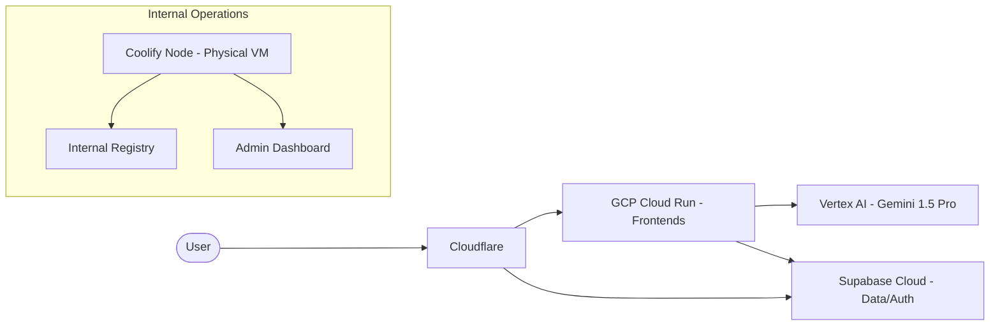

# Best Practice Infrastructure Framework

## 1. Governance & Compliance (ISO 27001)

A modern cloud-native architecture reduces the ISO 27001 evidence burden by inheriting the cloud provider's physical and environmental controls.

### Shared Responsibility Model

| Control Area | Responsibility |
| :--- | :--- |
| **Physical Security** | Inherited (GCP/Supabase/AWS) |
| **Network Infrastructure** | Inherited / Configured (GCP) |
| **Guest OS / Runtime** | Managed (Cloud Run / Supabase Functions) |
| **Application Logic / Auth** | **Common Bond** (RLS, RBAC, Code Security) |
| **Data Encryption** | Managed (At rest/In transit) |

---

## 2. Best Practice Architecture: The "Agent-First" Stack

For a growth-stage company building AI agents, the following stack is recommended:

### Key Drivers:
1.  **Velocity:** Zero infrastructure management. Code -> `git push` -> Deployment.
2.  **Cost:** Pay-per-request (Cloud Run) + Fixed Tier (Supabase Pro). Eliminates "idle" server costs for k3s control planes.
3.  **Security:** IAM-driven security (Workload Identity) instead of static service account keys.

---

## 3. Example Reference Environments

### Staging Environment
*   **Infrastructure:** GCP Project `receptor-staging` (Melbourne: `australia-southeast2`)
*   **Supabase:** Project `staging-receptor` (Supabase Cloud: `ap-southeast-2`)
*   **Deployment:** Automatic on PR merge to `main`.
*   **Testing:** Vitest + Playwright (GitHub Runners).

### Production Environment
*   **Infrastructure:** GCP Project `receptor-prod` (Melbourne: `australia-southeast2`)
*   **Supabase:** Project `prod-receptor` (Supabase Pro Plan: `ap-southeast-2`)
*   **Security:** Cloud Armor (WAF) + Cloudflare Zero Trust.
*   **Governance:** Mandatory Log export to BigQuery for ISO 27001 audit trails.

---

## 4. ISO 27001 Mapping

| ISO 27001:2022 Control | Implementation Implementation |
| :--- | :--- |
| **A.8.10 Information Deletion** | Supabase Cloud automated retention policies. |
| **A.8.12 Data Leakage Prevention** | GCP Cloud DLP (Data Loss Prevention) on Cloud Run ingress. |
| **A.5.21 Security in Supplier Relationships** | Document GCP/Supabase in Supplier Register (Inherit SOC2). |
| **A.8.15 Logging** | GCP Cloud Logging (centralized, immutable). |

> [!TIP]
> Moving to a managed stack simplifies **A.8.20 (Network Security)** as the cloud provider handles DDoS, IP reputation, and internal routing isolation natively.
