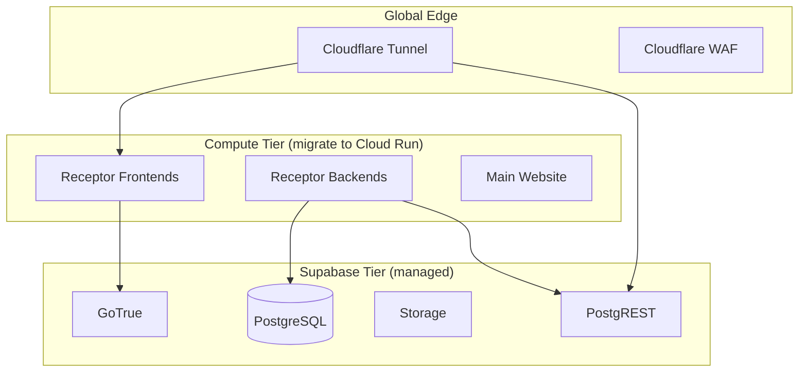

# Infrastructure Services Inventory

This document catalogs all services currently running in the self-hosted k3s cluster that require migration as part of the k3s retirement strategy.

## 1. Core Platform Services

| Service | Component | Source / Chart | Criticality | Migration Target (Proposed) |
| :--- | :--- | :--- | :--- | :--- |
| **Supabase** | DB, Auth, Storage, API | `supabase/supabase` | 🔴 Critical | **Supabase Cloud (Sydney)** |
| **Supabase Edge Functions** | Business Logic | `functions` | 🔴 Critical | **Supabase Cloud Cloud Functions** |
| **Vault** | Secrets Mgmt | `hashicorp/vault` | 🔴 Critical | **GCP Secret Manager / Azure KV** |
| **Cloudflare Tunnel** | Ingress/Egress | `cloudflared` | 🔴 Critical | **Cloudflare Tunnel (Standalone)** |
| **Cert-Manager** | TLS Certificates | `jetstack/cert-manager` | 🟠 High | **Cloud-native Managed SSL** |
| **Traefik/Kong** | API Gateway | `traefik` / `kong` | 🟠 High | **Cloud Run / Supabase Kong** |

## 2. CI/CD Infrastructure

| Service | Component | Source / Chart | Role | Migration Target |
| :--- | :--- | :--- | :--- | :--- |
| **GitHub ARC** | Actions Runners | `oci://actions-runner...` | CI Execution | **GitHub-Hosted Runners (`ubuntu-latest`)** |
| **Zot Registry** | OCI Cache | `zot/zot` | Image Delivery | **GCP Artifact Registry (Melbourne)** |

## 3. Monitoring & Security (Sidecar/Infra)

| Service | Component | Source / Chart | Role | Migration Target |
| :--- | :--- | :--- | :--- | :--- |
| **Prometheus/Grafana** | Observability | `kube-prometheus-stack` | Metrics | **Grafana Cloud / Cloud Ops** |
| **Loki** | Log Aggregation | `grafana/loki-stack` | Logging | **GCP Cloud Logging** |
| **Falco / Kyverno** | Security | `falco`, `kyverno` | Runtime/Policy | **GCP Policy Controller / Cloud Armor** |

---

## Service Dependency Map

> [!IMPORTANT]
> **Data Residency:** All target services MUST be pinned to Australian regions. 
> - **Compute (GCP):** Melbourne (`australia-southeast2`)
> - **Data (Supabase):** Sydney (`ap-southeast-2`) — This is the only currently supported Australian region for Supabase Cloud.

> [!NOTE]
> **Agentic Workflow Integration:** Google Cloud (GCP) is the preferred compute home for Receptor backends due to native integration with Vertex AI (Gemini) and Google's expansive AI agent SDKs.
