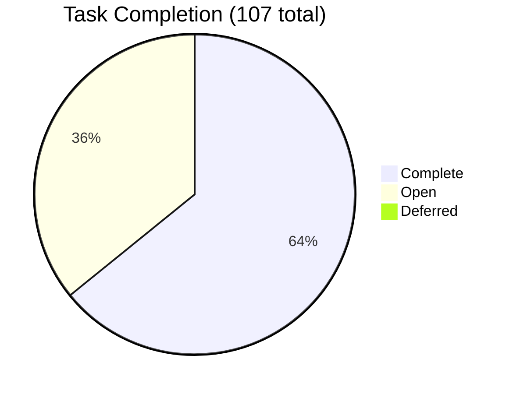
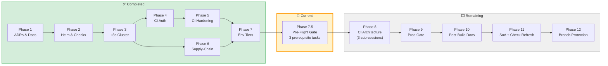
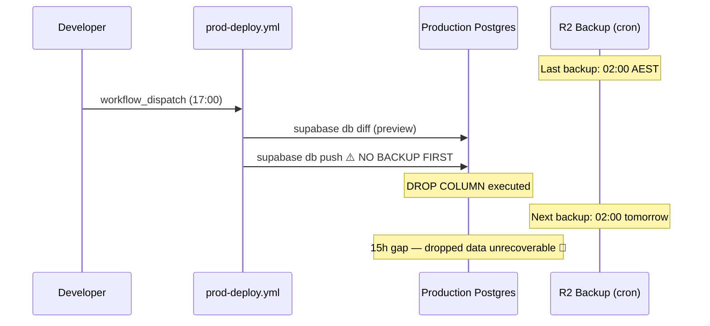
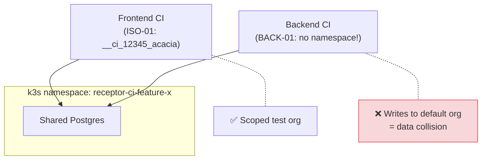
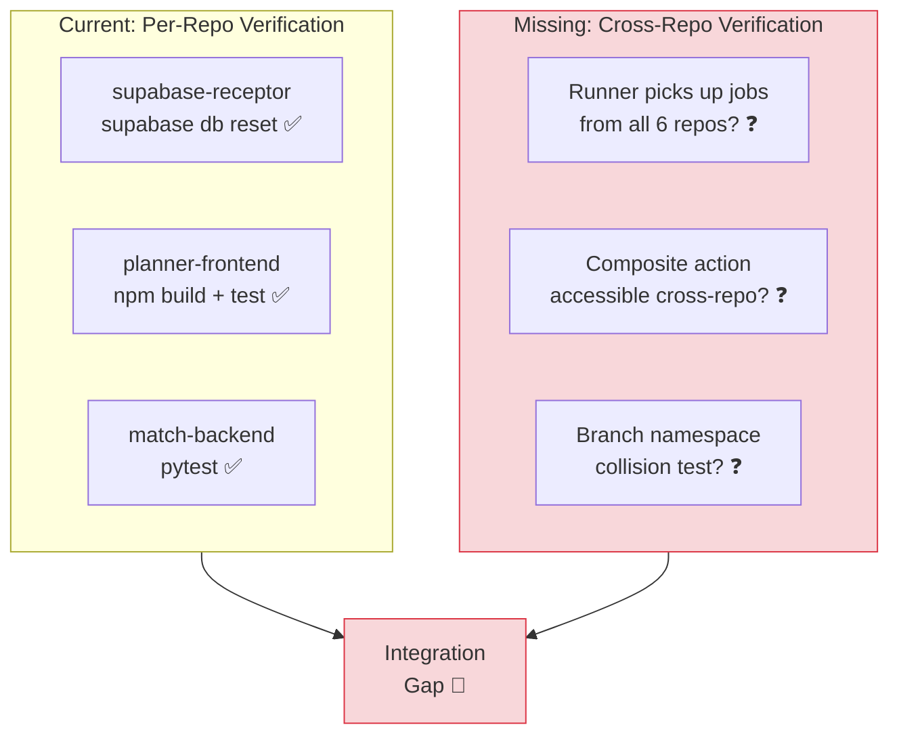
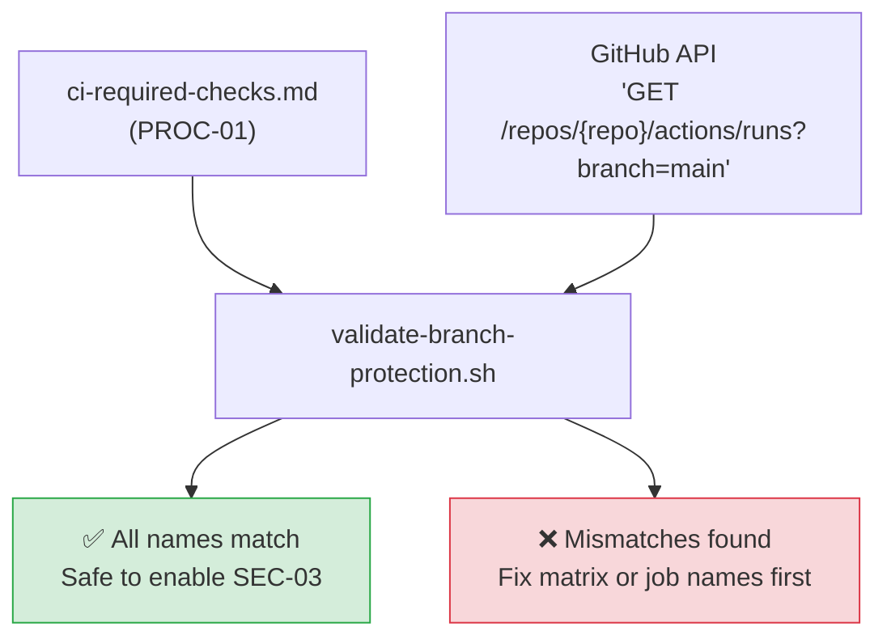

# Pre-Phase-7.5 Comprehensive Review — 260312-cicd-environments

**State:** 8 sessions complete · 38 open tasks · Phases 1–7 done · Phase 7.5 next
**Review date:** 2026-03-13 · **Review #3**

---

## Audit Progress Overview





---

## Context

This review evaluates the audit's structural integrity after 8 sessions and 68 completed tasks. The Phase 7.5 pre-flight gate was inserted (comprehensive_review_2) to address 5 gaps and 5 enhancements — those are **assumed accepted and in-scope**. This review identifies **new issues** that emerge from the amended plan, the accumulated implementation decisions, and the remaining 38 open tasks across Phases 7.5–12.

:::info
This review deliberately avoids repeating gaps from [comprehensive_review.md](./comprehensive_review) or [comprehensive_review_2.md](./comprehensive_review_2). All items below are net-new.
:::

---

## 🔴 Five Critical Gaps

### GAP-1 — `ENV-05` (Production Deploy Workflow) Has No Database Backup Gate Before Migration

`ENV-05-T1` creates `prod-deploy.yml` with `workflow_dispatch` and a `supabase db diff --schema public` step — but it does not trigger a backup before applying the migration. The backup script (`ENV-08-T1`) is designed as a standalone cron job, not as a callable pre-migration step.

This means a destructive migration (e.g. `ALTER TABLE ... DROP COLUMN`) runs against production Postgres with only the last scheduled backup as a recovery point. If the daily backup ran at 02:00 and the deploy fires at 17:00, the RPO for a botched migration is **15 hours** — not the documented 24h RPO, which assumes the failure is *between* backups, not *caused by* a deployment.

:::caution
This gap is invisible until the first production migration failure. The current ENV-05 → ENV-08 relationship is temporal (cron-based), not transactional (deploy-gated). A manual pre-deploy backup step exists conceptually in the promotion runbook but is not enforced by the workflow.
:::



**Fix:** Add a step in `ENV-05-T1` that invokes `scripts/backup-prod.sh` (or a lightweight `pg_dump --schema-only` + `pg_dump --data-only`) as a pre-migration gate in `prod-deploy.yml`. The deploy job should fail if the backup step exits non-zero. This converts the RPO from "time since last cron backup" to "time since deploy started" (≈0). Additionally, create a `docs/operations/migration-rollback.md` documenting: (1) how to restore from the pre-deploy backup; (2) `supabase db diff` reverse-migration generation; (3) when to use point-in-time recovery vs full restore; (4) communication protocol for failed production deploys.

---

### GAP-2 — `BACK-01` (Backend Integration Tests) Will Race with `ISO-01` Namespacing

`BACK-01-T2` adds a `supabase-start` step to `match-backend` CI and runs `pytest allocator/tests/integration/` against the ephemeral instance. But `ISO-01` (run-ID namespacing) only scopes the 3 **frontend** repos — the naming convention `__ci_{GITHUB_RUN_ID}_acacia` and the `if: always()` cleanup are specified for frontend `globalSetup`/`globalTeardown` only.

If `match-backend` and a frontend repo run concurrently against the same k3s Supabase namespace (which is the Phase 8 design — `ARCH-01` creates branch-matched namespaces), the backend integration tests will write to the **same** test org that the frontend is using — causing data interference.

:::caution
`BACK-01` is in Phase 8 but `ISO-01` was scoped to "preference-frontend, planner-frontend, workforce-frontend" — the backend repos are not listed. This is a gap in finding scope, not in implementation.
:::



**Fix:** Extend `ISO-01`'s scope to include `match-backend` and `planner-backend`. The backend repos should use the same `__ci_{GITHUB_RUN_ID}` naming convention. Add a clarification in `recommendations.json` specifying that ISO-01 applies to **all repos that boot Supabase in CI**, not just the three frontends.

---

### GAP-3 — `DOC-01` (Vault Configuration Guide) and `ARCH-11` (Vault OIDC ADR) Overlap Without Delineation

Phase 7.5 added `ARCH-11-T1`: write `ADR-005-vault-ci-oidc-bridge.md`. Phase 10 contains `DOC-01-T1`: write `vault-configuration.md` covering OIDC JWT auth, database secrets engine, KV v2, and VSO. Both documents cover the OIDC authentication flow — one as an ADR (decision record), one as an operational guide.

The risk is not duplication per se — ADRs and guides serve different audiences — but that the **OIDC flow will be written twice by different agents in different sessions** with no cross-reference, potentially with incompatible Vault policy names, path conventions, or bound claims.

:::info
Phase 7.5 (ARCH-11) will be written by the next implementing agent. Phase 10 (DOC-01) will be written 3–5 sessions later by a completely different agent context. Without a cross-reference, the later agent may re-derive the OIDC configuration from scratch.
:::

**Fix:** Add a note in `DOC-01-T1`'s description: *"This guide MUST cross-reference ADR-005-vault-ci-oidc-bridge.md (ARCH-11) for all OIDC architecture decisions. Do not re-derive Vault auth method, bound claims, or policy names — import them from the ADR."* This is a 1-line description amendment.

---

### GAP-4 — `CICD-09-T2` (Reusable Workflow Evaluation) Has No Acceptance Criteria

`CICD-09-T2` reads: *"Evaluate whether a reusable workflow (.github/workflows/supabase-ci-base.yml with 'on: workflow_call:') would further reduce the 3-boot-per-repo pattern (CICD-01). Document the evaluation as an ADR note."*

This task has no acceptance criteria — the implementing agent cannot determine whether to:
1. Write a "we evaluated and decided no" ADR note (task complete in 30 minutes), or
2. Actually build the reusable workflow and migrate all 6 repos (task takes 2–3 sessions)

The task status is `open` but neither outcome is defined as "done". This creates an open-ended obligation that could consume an entire session or be dismissed with a paragraph.

:::caution
Without acceptance criteria, any implementing agent will make an undocumented scope decision about CICD-09-T2. If they choose option 2 (build the workflow), it becomes the largest single task in the audit — larger than some entire phases. If they choose option 1, the evaluation may be superficial.
:::

**Fix:** Split `CICD-09-T2` into two tasks:
- `CICD-09-T2a`: *"Write an ADR note evaluating composite action vs reusable workflow for Supabase CI boot consolidation. Must include: (1) which CI jobs across all 6 repos currently boot Supabase independently; (2) whether a single `workflow_call` could replace individual boots; (3) decision with rationale."*
- `CICD-09-T2b` (conditional): *"If CICD-09-T2a recommends the reusable workflow: implement it. Otherwise, mark as 'not applicable' and close."*

---

### GAP-5 — No Verification Strategy for Phase 8 Cross-Repo Changes

Phase 8 Gate 8C touches all 6 repositories simultaneously (`ARCH-01`, `ARCH-03`, `CICD-01`). The `/implement-global-audit.md` workflow mandates "Run the repo-specific verification gate before committing" — but the verification gates (from audit-verification-gates SKILL) are **per-repo** (`npm run build && npm test` for frontends, `pytest` for backends, `supabase db reset` for supabase-receptor).

None of these per-repo gates verify that the **cross-repo interaction** works — specifically:
- That the self-hosted runner (ARCH-03) can actually pick up jobs from all 6 repos
- That the composite action (CICD-09-T1, hosted in supabase-receptor) is reachable from the other 5 repos
- That the branch-namespace naming (ARCH-01) doesn't collide when 2+ repos push to the same branch name



**Fix:** Add a Phase 8 Gate 8C verification protocol to `audit-brief.json` / `sessionGates`: after all 6 repos are committed, open a test PR in the smallest repo (e.g. `match-backend`) and verify the self-hosted runner picks up the job and the composite action resolves. This is the "integration test" for Phase 8 itself.

---

## 🟢 Five Critical Enhancements

### ENH-1 — Create a Phase Completion Checklist Template for Remaining Phases

Phases 1–7 were implemented without a standardised "phase complete" checklist — the implementing agent decided what constituted "done" for each phase. For the remaining 6 phases (7.5–12), a template would reduce handover risk:

**Proposed checklist (add to `audit-brief.json`):**

```markdown
## Phase N Completion Checklist
- [ ] All phase tasks marked complete in recommendations.json
- [ ] All repos committed and pushed to audit/260312-cicd-environments
- [ ] Per-repo verification gate passed for every changed repo
- [ ] Cross-repo verification passed (if phase involves >1 repo)
- [ ] recommendations.md re-rendered
- [ ] audit-brief.json sessionHistory entry added
- [ ] audit-brief.json openTaskCount updated
- [ ] SoA controls updated (if phase has compliance tasks)
- [ ] No new lint/type/build regressions introduced
```

This is a process enhancement that costs nothing to add and prevents the most common handover failure: incomplete state updates in the audit state machine.

---

### ENH-2 — Pin the `ARCH-03-T0` Parallel Trial to a Specific Repo Subset

`ARCH-03-T0` specifies a "7 consecutive clean CI runs" trial before fully switching to the k3s runner. But it doesn't specify **which repos** participate in the trial or whether all 6 must achieve 7 clean runs simultaneously.

If interpreted literally, achieving 42 clean CI runs (7 × 6 repos) with no flakes could take weeks — CI flakes are normal in any ecosystem. If only one repo is tested, the trial doesn't validate cross-repo runner scheduling.

**Proposed clarification:** The parallel trial should use **2 repos** — one frontend (`preference-frontend`, the most complex CI) and one backend (`match-backend`, the simplest). Both must achieve 7 consecutive clean runs on the self-hosted runner with `ubuntu-latest` as a commented fallback. Only after this 2-repo trial should the remaining 4 repos be migrated in a single batch.

```mermaid
gantt
    title ARCH-03 Parallel Trial — Proposed Staged Rollout
    dateFormat X
    axisFormat Day %s

    section Trial Phase
    preference-frontend (7 runs)     :a1, 0, 7
    match-backend (7 runs)           :a2, 0, 7
    Trial review + go/no-go          :milestone, 7, 0

    section Batch Migration
    planner-frontend                 :b1, 7, 8
    workforce-frontend               :b2, 7, 8
    planner-backend                 :b3, 7, 8
    supabase-receptor                :b4, 7, 8
    Full rollout verified            :milestone, 8, 0
```



---

### ENH-3 — Add Explicit k3s Provisioning Milestone Before `ENV-08-T1` and `ENV-11-T1`

`ENV-08-T1` (backup script) and `ENV-11-T1` (secondary backup destination) depend on a running k3s cluster with a reachable Postgres pod. Phase 3 (ARCH-04) completed the **manifests, ADRs, and configuration files** for the k3s cluster — but the cluster itself has not been physically provisioned on the Windows 11 Pro machine. These tasks remain correctly blocked.

However, the blocking relationship is implicit — no task or clarification in `recommendations.json` explicitly states that `ENV-08-T1` and `ENV-11-T1` require a running cluster. A future implementing agent who sees ARCH-04 marked `complete` might assume the cluster is operational and attempt the backup tasks prematurely.

:::tip
ARCH-04 `complete` means "all planning and manifest tasks done" — not "cluster is running." The physical provisioning of k3s on the Hyper-V host is an operational step outside the audit's task scope. ENV-08 and ENV-11 tasks should not be attempted until `kubectl get nodes` returns a `Ready` control plane.
:::

**Fix:** Add a clarification to `recommendations.json` for `ENV-08-T1` and `ENV-11-T1`:
*"Blocked: requires a running k3s cluster with Postgres accessible via kubectl port-forward. ARCH-04 completed the manifests and documentation only — physical cluster provisioning is an operational step that must be completed before these tasks can execute. Do not attempt until `kubectl get nodes` shows a Ready node."*

---

### ENH-4 — Consolidate `ARCH-05-T2` (ADR Governance Register) with Existing Supabase Common Bond Schema

`ARCH-05-T2` is marked open with: *"TODO (deferred): Create a dedicated 'architecture_decisions' table in supabase-common-bond."* The `supabase-common-bond` Supabase instance already has a `standards` table (from the 260309 governance audit) that could hold ADR records with a `category = 'adr'` discriminator.

Creating a separate `architecture_decisions` table would add a third governance table alongside `standards` and `risks` — increasing schema complexity for a table that might hold fewer than 20 records. The `standards` table already has columns for `reference`, `status`, and `owner` which map directly to ADR metadata.

**Proposed change:** Amend `ARCH-05-T2` to: *"Register each ADR as an entry in the existing `standards` table with category='adr'. Add a `document_path` column if not already present. Do NOT create a separate architecture_decisions table — use the existing governance schema."*

---

### ENH-5 — Add a `SEC-03` Pre-Check Script to Validate Required Check Names

`SEC-03-T1` (Phase 12) enables branch protection with required status checks across all 6 repos. If any check name is incorrect (typo, renamed job, or nonexistent check), the branch protection will **block all merges to main** until the ruleset is corrected — requiring admin override.

This is the highest-risk single task in the entire audit: one wrong string in a GitHub API call can halt all development.

**Proposed addition — `SEC-03-T0` (Phase 11, before SEC-03-T1):**
Create a dry-run script (`scripts/validate-branch-protection.sh`) that:
1. Reads the check matrix from `ci-required-checks.md` (PROC-01)
2. For each repo, queries the GitHub API for the most recent `main` branch CI run
3. Compares the actual job names against the matrix
4. Exits non-zero if any matrix entry doesn't match an actual job name



This converts the riskiest task in the audit from a one-shot operation to a validated, pre-checked process.

---

## Summary Table

| # | Type | ID | Severity | Finding |
|---|------|----|-----------|---------|
| 1 | 🔴 Gap | GAP-1 | **Critical** | `ENV-05` prod deploy runs migration with no pre-deploy backup — RPO gap up to 15h on botched migration |
| 2 | 🔴 Gap | GAP-2 | **High** | `BACK-01` backend integration tests not scoped by `ISO-01` — data collision when backend + frontend CI share a namespace |
| 3 | 🔴 Gap | GAP-3 | **Medium** | `DOC-01` and `ARCH-11` both cover Vault OIDC with no cross-reference — conflicting docs risk across sessions |
| 4 | 🔴 Gap | GAP-4 | **Medium** | `CICD-09-T2` (reusable workflow evaluation) has no acceptance criteria — unbounded scope risk |
| 5 | 🔴 Gap | GAP-5 | **High** | Phase 8 Gate 8C has no cross-repo verification strategy — per-repo gates don't test runner + composite action integration |
| 6 | 🟢 Enhancement | ENH-1 | Process | Phase completion checklist template for Phases 7.5–12 — standardises "done" criteria across agent handovers |
| 7 | 🟢 Enhancement | ENH-2 | Process | Pin `ARCH-03-T0` parallel trial to 2 repos (preference-frontend + match-backend) before batch migration |
| 8 | 🟢 Enhancement | ENH-3 | Tracking | Add explicit k3s provisioning blocker note to `ENV-08-T1` and `ENV-11-T1` — ARCH-04 completed manifests only, cluster not yet running |
| 9 | 🟢 Enhancement | ENH-4 | Structural | Consolidate `ARCH-05-T2` ADR register into existing `standards` table — avoid unnecessary schema proliferation |
| 10 | 🟢 Enhancement | ENH-5 | Safety | Add `SEC-03-T0` dry-run validation script — pre-check required status check names before enabling branch protection |

---

## Review Lineage

| Review | Date | Focus | Key Outcomes |
|--------|------|-------|-------------|
| [comprehensive_review.md](./comprehensive_review) | 2026-03-12 | Full audit validity, 6 caveats | CICD-10 created, ENV-08 backup host clarified, PROC-01-T2 recommended |
| [comprehensive_review_2.md](./comprehensive_review_2) | 2026-03-13 | Phase 8 dependencies, 5 gaps + 5 enhancements | Phase 7.5 gate created, ARCH-11/ARCH-02-T0/ARCH-03-T0/ISO-01-T2 added, CICD-09 moved to Phase 8 |
| **This review** | 2026-03-13 | Late-audit structural gaps, remaining execution risk | Pre-deploy backup gate, backend ISO scope, cross-repo verification, SEC-03 dry-run |
