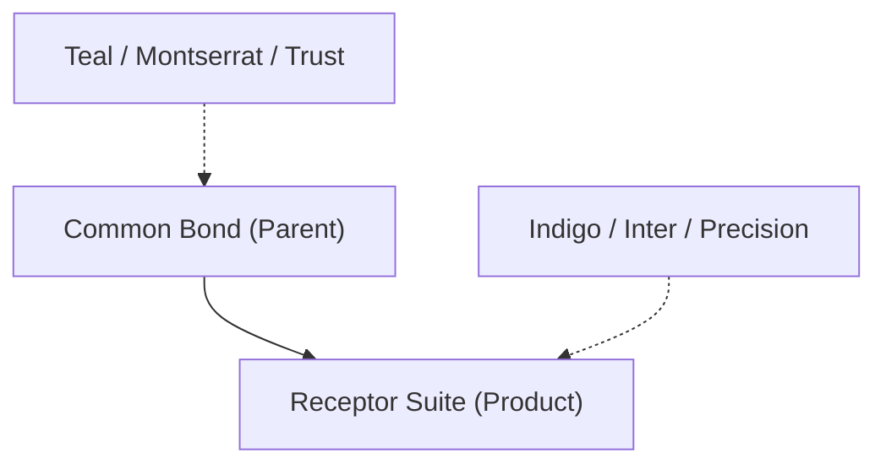

# 🎨 Brand Architecture

*Unified vision. Specialized products. Distinct identities.*

Common Bond operates under a **"House of Brands"** strategy, maintaining a clear distinction between our corporate parent identity and our specialized product suite, Receptor.

---

## The Identity Split

We maintain two distinct visual languages to serve different stakeholders and environments.

| Identity | Focus | Primary Palette | Key Typeface |
|:---|:---|:---|:---|
| **[Common Bond](./common-bond)** | Corporate / Investor | Teal & Slate | Montserrat |
| **[Receptor Suite](./receptor-suite)** | Product / Clinical | Indigo & Slate | Inter |

---

## Visual Summary

### [Common Bond (Corporate)](./common-bond)
The consulting and advisory wrapper. This identity is used for investment materials, corporate communications, and high-level strategy. It emphasizes **institutional trust** and **foundational unity**.

### [Receptor Suite (Product)](./receptor-suite)
The clinical-facing software platform. This identity is used within technical interfaces, mobile applications, and user documentation. It emphasizes **algorithmic precision** and **clinical efficiency**.

---

:::tip Brand Integrity
While the palettes and typefaces differ, both identities share our core values of **Fairness**, **Transparency**, and **Clinical Expertise**.
:::
