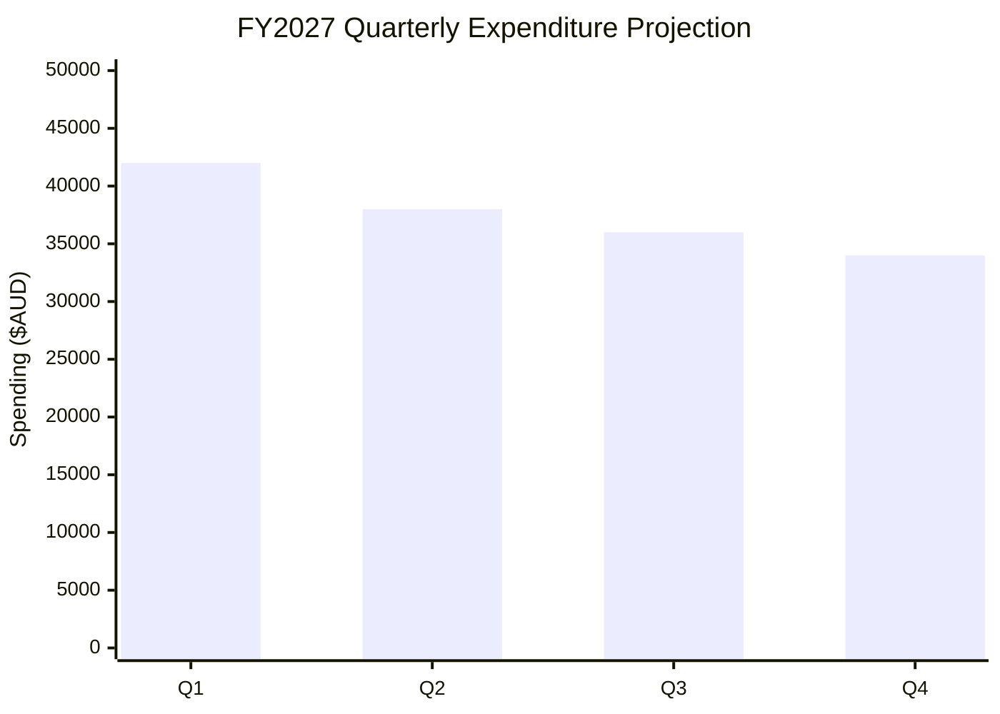
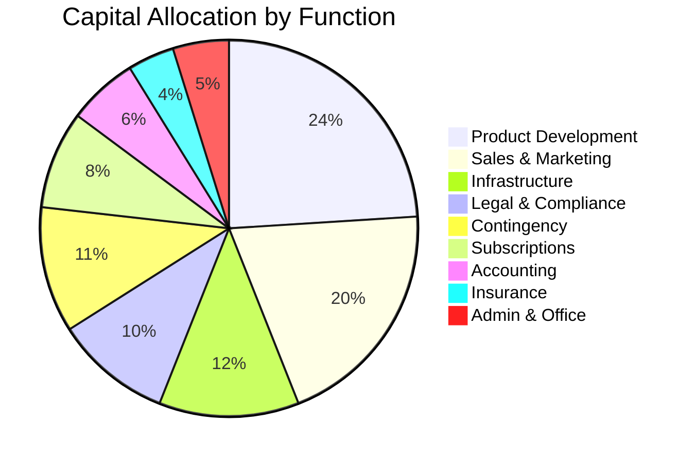

# Funding & Capital Efficiency Plan

Receptor follows a **"Capital Efficient"** growth model, prioritizing organic revenue and non-dilutive funding where possible. This document outlines the initial capital structure and detailed FY2027 budget projections.

---

## 1. Initial Capital Injection

Common Bond will commence operations with a **founder capital injection of $150,000 AUD** to support initial product launch, market entry, and operational establishment.

| **Source** | **Amount** | **Purpose** |
|-----------|-----------|-------------|
| **Founder Investment** | $150,000 | Initial operational runway and product development |

This capital will provide approximately **12-18 months of runway** based on the projected FY2027 budget below, allowing the business to reach key revenue milestones before requiring external funding.

---

## 2. FY2027 Budget Overview (July 2026 – June 2027)

The following budget represents our projected operating costs for the first full financial year. All figures are in **AUD**.

### 2.1 Budget Summary

| **Category** | **Annual Budget** | **% of Total** |
|--------------|------------------|----------------|
| Product Development & Engineering | $36,000 | 24.0% |
| Hosting & Infrastructure | $18,000 | 12.0% |
| Software & Subscriptions | $12,600 | 8.4% |
| Sales & Marketing | $30,000 | 20.0% |
| Accounting & Financial Services | $9,000 | 6.0% |
| Legal & Compliance | $15,000 | 10.0% |
| Insurance & Risk | $6,000 | 4.0% |
| Office & Administrative | $7,200 | 4.8% |
| Contingency Reserve | $16,200 | 10.8% |
| **Total** | **$150,000** | **100%** |

---

### 2.2 Detailed Category Breakdown

#### A. Product Development & Engineering ($36,000)

Investment in core platform development and technical capabilities.

| **Item** | **Monthly** | **Annual** | **Notes** |
|----------|------------|-----------|-----------|
| Development Tools & IDEs | $150 | $1,800 | JetBrains, Cursor, Figma Pro |
| AI Development Credits | $300 | $3,600 | Claude API, GitHub Copilot |
| Contractor Development | $2,000 | $24,000 | Specialized feature development bursts |
| QA & Testing Infrastructure | $200 | $2,400 | Automated testing suites |
| Documentation & Training | $100 | $1,200 | Technical writing, onboarding materials |
| Security Audits | $250 | $3,000 | Annual penetration testing & compliance |

#### B. Hosting & Infrastructure ($18,000)

Cloud infrastructure and data management costs.

| **Item** | **Monthly** | **Annual** | **Notes** |
|----------|------------|-----------|-----------|
| Supabase Pro (Production) | $500 | $6,000 | Primary database & auth |
| Supabase Pro (Staging) | $250 | $3,000 | Development & testing environment |
| Cloudflare Enterprise | $200 | $2,400 | DDoS protection, CDN, Workers |
| Domain & SSL | $50 | $600 | Multi-domain management |
| Backup & Disaster Recovery | $300 | $3,600 | Automated off-site backups |
| Monitoring & Observability | $200 | $2,400 | Uptime monitoring, error tracking |

#### C. Software & Subscriptions ($12,600)

Operational SaaS tools and productivity software.

| **Item** | **Monthly** | **Annual** | **Notes** |
|----------|------------|-----------|-----------|
| Google Workspace | $100 | $1,200 | Business email & collaboration |
| Slack (Business+) | $75 | $900 | Team communication |
| Notion / Confluence | $50 | $600 | Knowledge management |
| Linear / Jira | $50 | $600 | Project management |
| Datadog / Sentry | $150 | $1,800 | Application monitoring |
| HubSpot CRM (Starter) | $200 | $2,400 | Customer relationship management |
| Zoom (Business) | $150 | $1,800 | Video conferencing & webinars |
| Design Tools (Figma, Canva) | $100 | $1,200 | UI/UX design & marketing assets |
| Password Management (1Password) | $50 | $600 | Security & credential management |
| Miscellaneous SaaS | $125 | $1,500 | Ad-hoc tools & integrations |

#### D. Sales & Marketing ($30,000)

Customer acquisition and brand development.

| **Item** | **Monthly** | **Annual** | **Notes** |
|----------|------------|-----------|-----------|
| Digital Advertising | $800 | $9,600 | LinkedIn, Google Ads (healthcare focus) |
| Content Marketing | $400 | $4,800 | Blog posts, whitepapers, case studies |
| Trade Shows & Conferences | $300 | $3,600 | Australian health tech events |
| Collateral & Branding | $200 | $2,400 | Brochures, pitch decks, merchandise |
| Travel & Client Meetings | $400 | $4,800 | SA/WA expansion activities |
| PR & Communications | $200 | $2,400 | Press releases, media relations |
| Website Maintenance | $100 | $1,200 | Updates, SEO optimization |
| Referral & Partner Programs | $100 | $1,200 | Incentive programs |

#### E. Accounting & Financial Services ($9,000)

Professional financial management and compliance.

| **Item** | **Monthly** | **Annual** | **Notes** |
|----------|------------|-----------|-----------|
| Bookkeeping Services | $400 | $4,800 | Monthly reconciliation & reporting |
| Annual Audit / Review | - | $2,400 | End-of-year financial review |
| Xero / MYOB | $100 | $1,200 | Accounting software |
| Payroll Processing | $50 | $600 | When employees are onboarded |

#### F. Legal & Compliance ($15,000)

Company establishment and ongoing legal requirements.

| **Item** | **Monthly** | **Annual** | **Notes** |
|----------|------------|-----------|-----------|
| Company Registration (ASIC) | - | $600 | Pty Ltd setup & annual fees |
| Constitution & Shareholder Agreements | - | $3,000 | Initial legal documentation |
| Privacy Policy & Terms of Service | - | $2,000 | Healthcare-compliant policies |
| Contract Templates | - | $2,500 | SaaS agreements, NDA, partnerships |
| Trademark Registration | - | $1,500 | Brand protection |
| Ongoing Legal Retainer | $250 | $3,000 | General counsel (ad-hoc) |
| Data Protection Compliance | $200 | $2,400 | Privacy Act, healthcare regulations |

#### G. Insurance & Risk ($6,000)

Business protection and liability coverage.

| **Item** | **Monthly** | **Annual** | **Notes** |
|----------|------------|-----------|-----------|
| Professional Indemnity | - | $2,400 | Errors & omissions coverage |
| Public Liability | - | $1,200 | General business liability |
| Cyber Insurance | - | $1,800 | Data breach & cyber attack coverage |
| Directors & Officers Insurance | - | $600 | D&O liability |

#### H. Office & Administrative ($7,200)

Day-to-day operational expenses.

| **Item** | **Monthly** | **Annual** | **Notes** |
|----------|------------|-----------|-----------|
| Co-working Space / Hot Desk | $350 | $4,200 | Flexible workspace for meetings |
| Office Supplies | $75 | $900 | Stationery, equipment |
| Phone & Communications | $100 | $1,200 | Business phone lines |
| Miscellaneous Admin | $75 | $900 | Postal, printing, etc. |

#### I. Contingency Reserve ($16,200)

Held for unexpected expenses, opportunity costs, and cash flow management.

| **Purpose** | **Amount** | **Notes** |
|-------------|-----------|-----------|
| Emergency Fund | $8,000 | Unforeseen technical or legal issues |
| Opportunity Fund | $5,000 | Strategic partnerships or rapid scaling |
| Cash Flow Buffer | $3,200 | Revenue timing gaps |

---

## 3. Quarterly Spending Projection

| **Quarter** | **Projected Spend** | **Cumulative** | **Notes** |
|-------------|--------------------|--------------------|-----------|
| Q1 (Jul-Sep 2026) | $42,000 | $42,000 | Heavy legal setup, initial marketing push |
| Q2 (Oct-Dec 2026) | $38,000 | $80,000 | Infrastructure scaling, conference season |
| Q3 (Jan-Mar 2027) | $36,000 | $116,000 | Steady state operations |
| Q4 (Apr-Jun 2027) | $34,000 | $150,000 | Optimization, preparing for FY28 |

---

## 4. Funding Strategy

### 4.1 Non-Dilutive Funding Sources

These are priority funding mechanisms to extend runway without equity dilution:

| **Source** | **Potential Value** | **Timeline** | **Status** |
|------------|--------------------|--------------|--------------------|
| **R&D Tax Incentive (RDTI)** | $15,000 - $25,000 | Q4 FY27 | Planning |
| **Export Market Development Grant (EMDG)** | $5,000 - $10,000 | FY28 | Future consideration |
| **MRFF Health System Improvement Grant** | $50,000 - $150,000 | FY28 | Future application |
| **SA/WA State Innovation Grants** | $10,000 - $30,000 | FY27-28 | Research phase |

### 4.2 Dilutive Funding (If Required)

Strategic investment to accelerate growth:

- **Seed Funding (Optional):** Strategic investment from clinicians or health-tech specialized VCs to accelerate interstate expansion.
- **Target Raise:** $300,000 - $500,000 at pre-money valuation of $1.5M - $2M.
- **Use of Funds:** Accelerated SA/WA market entry, dedicated sales hire, enhanced product features.

---

## 5. Capital Allocation Strategy

The founder capital will be allocated across key growth drivers:

---

## 6. Financial Milestones

| **Milestone** | **Target Date** | **Success Metric** |
|---------------|-----------------|-------------------|
| **Company Established** | Q1 FY27 (Jul 2026) | Pty Ltd registered, bank accounts active |
| **First Paying Customer** | Q2 FY27 (Oct 2026) | Signed contract with pilot LHN |
| **$50K ARR** | Q3 FY27 (Feb 2027) | Covering ~33% of operating costs |
| **Cash-Flow Positive** | Q1 FY28 (Aug 2027) | Monthly revenue exceeds expenses |
| **$150K ARR** | Q2 FY28 (Dec 2027) | Full operational cost recovery |
| **Series A Ready** | Q4 FY28 (Apr 2028) | Demonstrated national scalability |

---

## 7. Revenue Break-Even Analysis

Based on the [Revenue Model](/docs/business-planning/finance/revenue-model) and [Pricing Projections](/docs/business-planning/finance/pricing-projections), break-even is projected as follows:

### Per-Match Pricing

| **Cohort Size** | **Price per Match (excl. GST)** |
|-----------------|--------------------------------|
| Up to 50 people | **$2,100** |
| Up to 100 people | **$2,900** |
| Over 100 people | **$3,200** |

### Break-Even Scenarios

| **Scenario** | **Annual OpEx** | **Required ARR** | **Example Contract Mix** |
|--------------|-----------------|-----------------|--------------------------|
| **Minimum Viable** | $100,000 | $100,000 | 4 Metro LHNs (e.g., Alfred, Austin, Eastern, Northern) |
| **Target (FY27)** | $150,000 | $150,000 | 5 Metro + 3 Regional (e.g., Monash, Alfred, + Bendigo, Barwon) |
| **Growth (FY28)** | $180,000 | $180,000 | 8 VIC Metro + 4 Regional + 2 SA/WA |

### FY2027 Target Scenario Detail

To achieve **$41,500 ARR** (Target scenario from pricing projections):

| **Health Service** | **Matches** | **Revenue** |
|--------------------|-------------|-------------|
| Monash Health | 3 × $3,200 | $9,600 |
| Alfred Health | 3 × $2,900 | $8,700 |
| Austin Health | 3 × $2,900 | $8,700 |
| Royal Melbourne Hospital | 3 × $2,900 | $8,700 |
| Eastern Health | 2 × $2,900 | $5,800 |
| **Total** | **14 matches** | **$41,500** |

📊 See [Pricing Projections](/docs/business-planning/finance/pricing-projections) for comprehensive phase-by-phase analysis.

---

## 8. Risk Mitigation

| **Risk** | **Mitigation** | **Contingency** |
|----------|-----------------|-----------------|
| Slower than expected sales cycle | Focus on warm leads (PMCV network) | Extend runway via cost reduction |
| Technical infrastructure costs increase | Lock in annual pricing; use serverless | Migrate to alternative providers |
| Legal complications | Proactive compliance investment | Legal retainer for rapid response |
| Key person dependency | Document all processes; cross-training | Contractor network for continuity |

---

:::tip Capital Efficiency Principles
1. **Revenue First:** Prioritize activities that generate customer contracts.
2. **Lean Operations:** Maximize use of existing team skills before hiring.
3. **Strategic Spend:** Every dollar should directly support customer acquisition or product improvement.
4. **Non-Dilutive Priority:** Pursue grants and tax incentives before external investment.
:::
