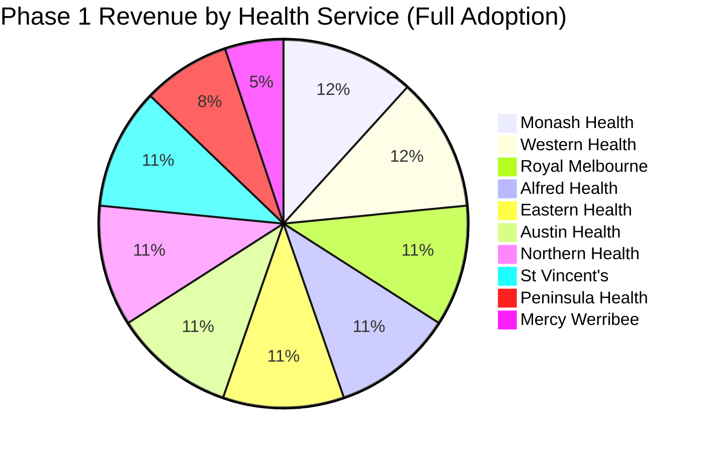
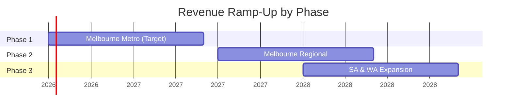

# Pricing Projections by Region & Phase

This document provides detailed revenue projections for Receptor's market expansion, organized by geographic phase. All projections are based on publicly available intern/JMO position data from PMCV, SA MET, and WA Health.

---

## Pricing Summary

| **Cohort Size** | **Price per Match (excl. GST)** |
|-----------------|--------------------------------|
| Up to 50 people | **$2,100** |
| Up to 100 people | **$2,900** |
| Over 100 people | **$3,200** |

:::info Data Sources
- **Victoria:** [PMCV Allocation & Placement Service](https://pmcv.com.au) - 2024 Match data (2025 start positions)
- **South Australia:** [SA MET](https://samet.org.au) and SA Health
- **Western Australia:** [WA Health](https://health.wa.gov.au) and MedCareersWA
:::

---

## Phase 1: Melbourne Metropolitan (FY2027)

**Target:** Major metropolitan health services in Victoria  
**Timeline:** July 2026 – June 2027

### 1.1 Target Health Services

Based on 2024 Match data from PMCV, the following metropolitan health services are prioritised:

| **Health Service** | **Intern Positions** | **Tier** | **Est. PGY2** | **Est. PGY3+** | **Matches** |
|--------------------|---------------------|----------|---------------|----------------|-------------|
| **Monash Health** | 125 | >100 | 155 | 180+ | 3 |
| **Western Health** | 100 | >100 | ~100 | ~90 | 3 |
| **The Royal Melbourne Hospital** | 78 | 51-100 | ~80 | ~70 | 3 |
| **Alfred Health** | 74 | 51-100 | ~68 | ~60 | 3 |
| **Eastern Health** | 70 | 51-100 | ~65 | ~50 | 3 |
| **Austin Health** | 65 | 51-100 | ~60 | ~55 | 3 |
| **Northern Health** | 61 | 51-100 | ~55 | ~45 | 3 |
| **St Vincent's Health** | 60 | 51-100 | ~55 | ~50 | 3 |
| **Peninsula Health** | 46 | ≤50 | ~40 | ~35 | 3 |
| **Mercy Health Werribee** | 20 | ≤50 | ~18 | - | 2 |

### 1.2 Revenue Projection - Phase 1

| **Health Service** | **Intern Match** | **PGY2 Match** | **PGY3+ Match** | **Annual Total** |
|--------------------|-----------------|----------------|-----------------|------------------|
| **Monash Health** | $3,200 | $3,200 | $3,200 | **$9,600** |
| **Western Health** | $3,200 | $3,200 | $3,200 | **$9,600** |
| **Royal Melbourne Hospital** | $2,900 | $2,900 | $2,900 | **$8,700** |
| **Alfred Health** | $2,900 | $2,900 | $2,900 | **$8,700** |
| **Eastern Health** | $2,900 | $2,900 | $2,900 | **$8,700** |
| **Austin Health** | $2,900 | $2,900 | $2,900 | **$8,700** |
| **Northern Health** | $2,900 | $2,900 | $2,900 | **$8,700** |
| **St Vincent's Health** | $2,900 | $2,900 | $2,900 | **$8,700** |
| **Peninsula Health** | $2,100 | $2,100 | $2,100 | **$6,300** |
| **Mercy Health Werribee** | $2,100 | $2,100 | - | **$4,200** |

### 1.3 Phase 1 Summary

| **Scenario** | **Health Services** | **Total Matches** | **Annual Revenue** |
|--------------|--------------------|--------------------|-------------------|
| **Conservative** (3 clients) | Monash, Alfred, Austin | 9 | **$24,100** |
| **Target** (5 clients) | + Royal Melbourne, Eastern | 15 | **$41,500** |
| **Optimistic** (8 clients) | + Northern, St Vincent's, Western | 24 | **$67,600** |
| **Full Adoption** (10 clients) | All Phase 1 targets | 29 | **$81,900** |

---

## Phase 2: Melbourne Regional (FY2028)

**Target:** Regional Victorian health services  
**Timeline:** July 2027 – June 2028

### 2.1 Target Health Services

| **Health Service** | **Intern Positions** | **Tier** | **Est. PGY2** | **Matches** |
|--------------------|---------------------|----------|---------------|-------------|
| **Barwon Health** (Geelong) | 45 | ≤50 | ~40 | 2 |
| **Bendigo Health** | 40 | ≤50 | ~35 | 2 |
| **Grampians Health Ballarat** | 35 | ≤50 | ~30 | 2 |
| **Goulburn Valley Health** | 32 | ≤50 | ~28 | 2 |
| **Gippsland Rural Intern Training** | 31 | ≤50 | ~25 | 2 |
| **Albury Wodonga Health** | 15 | ≤50 | ~12 | 2 |
| **Mildura Base Public Hospital** | 10 | ≤50 | ~8 | 1-2 |
| **Northeast Health Wangaratta** | 9 | ≤50 | ~7 | 1-2 |
| **Barwon South West RG Program** | 5 | ≤50 | - | 1 |
| **Gippsland RG Program** | 5 | ≤50 | - | 1 |
| **South West Health** | 10 | ≤50 | ~8 | 1-2 |
| **Bairnsdale Regional Health** | 5 | ≤50 | - | 1 |

### 2.2 Revenue Projection - Phase 2

All regional services fall into the **≤50 tier ($2,100 per match)**.

| **Health Service** | **Intern Match** | **PGY2 Match** | **Annual Total** |
|--------------------|-----------------|----------------|------------------|
| **Barwon Health** | $2,100 | $2,100 | **$4,200** |
| **Bendigo Health** | $2,100 | $2,100 | **$4,200** |
| **Grampians Health Ballarat** | $2,100 | $2,100 | **$4,200** |
| **Goulburn Valley Health** | $2,100 | $2,100 | **$4,200** |
| **Gippsland Rural Intern Training** | $2,100 | $2,100 | **$4,200** |
| **Albury Wodonga Health** | $2,100 | $2,100 | **$4,200** |
| **Mildura Base Public Hospital** | $2,100 | $2,100 | **$4,200** |
| **Northeast Health Wangaratta** | $2,100 | $2,100 | **$4,200** |
| **South West Health** | $2,100 | $2,100 | **$4,200** |
| **Smaller RG Programs** (4 sites) | $2,100 | - | **$8,400** |

### 2.3 Phase 2 Summary

| **Scenario** | **Health Services** | **Total Matches** | **Annual Revenue** |
|--------------|--------------------|--------------------|-------------------|
| **Conservative** (3 clients) | Barwon, Bendigo, Grampians | 6 | **$12,600** |
| **Target** (6 clients) | + Goulburn Valley, Gippsland, Albury Wodonga | 12 | **$25,200** |
| **Full Adoption** (12 clients) | All Phase 2 targets | 21 | **$46,200** |

---

## Phase 3: South Australia (FY2028-29)

**Target:** SA Health Local Health Networks  
**Timeline:** January 2028 – December 2028

### 3.1 SA Health Network Overview

South Australia has approximately **9 Local Health Networks (LHNs)** with medical training programs. SALHN welcomes ~85 new interns annually.

| **Local Health Network** | **Est. Interns** | **Tier** | **Est. PGY2** | **Matches** |
|--------------------------|-----------------|----------|---------------|-------------|
| **Central Adelaide LHN (CALHN)** | ~100-120 | >100 | ~110 | 3 |
| **Southern Adelaide LHN (SALHN)** | ~85 | 51-100 | ~80 | 3 |
| **Northern Adelaide LHN (NALHN)** | ~60 | 51-100 | ~55 | 3 |
| **Flinders and Upper North LHN** | ~25 | ≤50 | ~20 | 2 |
| **Barossa Hills Fleurieu LHN** | ~15 | ≤50 | ~12 | 2 |
| **Riverland Mallee Coorong LHN** | ~12 | ≤50 | ~10 | 2 |
| **Eyre and Far North LHN** | ~10 | ≤50 | ~8 | 1-2 |
| **Yorke and Northern LHN** | ~8 | ≤50 | ~6 | 1-2 |
| **Limestone Coast LHN** | ~8 | ≤50 | ~6 | 1-2 |

### 3.2 Revenue Projection - Phase 3 (SA)

| **Local Health Network** | **Intern Match** | **PGY2 Match** | **PGY3+ Match** | **Annual Total** |
|--------------------------|-----------------|----------------|-----------------|------------------|
| **CALHN** | $3,200 | $3,200 | $3,200 | **$9,600** |
| **SALHN** | $2,900 | $2,900 | $2,900 | **$8,700** |
| **NALHN** | $2,900 | $2,900 | $2,900 | **$8,700** |
| **Flinders and Upper North** | $2,100 | $2,100 | - | **$4,200** |
| **Barossa Hills Fleurieu** | $2,100 | $2,100 | - | **$4,200** |
| **Riverland Mallee Coorong** | $2,100 | $2,100 | - | **$4,200** |
| **Eyre and Far North** | $2,100 | $2,100 | - | **$4,200** |
| **Yorke and Northern** | $2,100 | $2,100 | - | **$4,200** |
| **Limestone Coast** | $2,100 | $2,100 | - | **$4,200** |

### 3.3 Phase 3 (SA) Summary

| **Scenario** | **Health Networks** | **Total Matches** | **Annual Revenue** |
|--------------|--------------------|--------------------|-------------------|
| **Conservative** (2 clients) | CALHN, SALHN | 6 | **$18,300** |
| **Target** (4 clients) | + NALHN, Flinders/Upper North | 11 | **$31,200** |
| **Full Adoption** (9 clients) | All SA LHNs | 21 | **$52,200** |

---

## Phase 3: Western Australia (FY2028-29)

**Target:** WA Health and WACHS  
**Timeline:** January 2028 – December 2028

### 3.4 WA Health Network Overview

WA Health has 5 Primary Employing Health Services (PEHS) in Perth metro, plus WACHS regional sites. South Metropolitan Health Service alone hires **135+ interns annually**.

| **Health Service** | **Est. Interns** | **Tier** | **Est. PGY2** | **Matches** |
|--------------------|-----------------|----------|---------------|-------------|
| **Fiona Stanley Hospital (SMHS)** | ~135 | >100 | ~120 | 3 |
| **Royal Perth Hospital** | ~80 | 51-100 | ~75 | 3 |
| **Sir Charles Gairdner Hospital** | ~70 | 51-100 | ~65 | 3 |
| **Joondalup Health Campus** | ~50 | ≤50 | ~45 | 2-3 |
| **St John of God Midland** | ~40 | ≤50 | ~35 | 2-3 |
| **WACHS - Albany** | ~15 | ≤50 | ~12 | 2 |
| **WACHS - Bunbury** | ~20 | ≤50 | ~15 | 2 |
| **WACHS - Geraldton** | ~12 | ≤50 | ~10 | 2 |
| **WACHS - Broome/Kimberley** | ~10 | ≤50 | ~8 | 2 |

### 3.5 Revenue Projection - Phase 3 (WA)

| **Health Service** | **Intern Match** | **PGY2 Match** | **PGY3+ Match** | **Annual Total** |
|--------------------|-----------------|----------------|-----------------|------------------|
| **Fiona Stanley Hospital** | $3,200 | $3,200 | $3,200 | **$9,600** |
| **Royal Perth Hospital** | $2,900 | $2,900 | $2,900 | **$8,700** |
| **Sir Charles Gairdner Hospital** | $2,900 | $2,900 | $2,900 | **$8,700** |
| **Joondalup Health Campus** | $2,100 | $2,100 | $2,100 | **$6,300** |
| **St John of God Midland** | $2,100 | $2,100 | $2,100 | **$6,300** |
| **WACHS - Albany** | $2,100 | $2,100 | - | **$4,200** |
| **WACHS - Bunbury** | $2,100 | $2,100 | - | **$4,200** |
| **WACHS - Geraldton** | $2,100 | $2,100 | - | **$4,200** |
| **WACHS - Broome/Kimberley** | $2,100 | $2,100 | - | **$4,200** |

### 3.6 Phase 3 (WA) Summary

| **Scenario** | **Health Services** | **Total Matches** | **Annual Revenue** |
|--------------|--------------------|--------------------|-------------------|
| **Conservative** (2 clients) | Fiona Stanley, Royal Perth | 6 | **$18,300** |
| **Target** (4 clients) | + Sir Charles Gairdner, Joondalup | 11 | **$33,300** |
| **Full Adoption** (9 clients) | All WA targets | 23 | **$56,400** |

---

## Consolidated Revenue Summary

### By Phase

| **Phase** | **Timeline** | **Conservative** | **Target** | **Full Adoption** |
|-----------|--------------|-----------------|-----------|------------------|
| **Phase 1: Melbourne Metro** | FY2027 | $24,100 | $41,500 | $81,900 |
| **Phase 2: Melbourne Regional** | FY2028 | $12,600 | $25,200 | $46,200 |
| **Phase 3a: South Australia** | FY2028-29 | $18,300 | $31,200 | $52,200 |
| **Phase 3b: Western Australia** | FY2028-29 | $18,300 | $33,300 | $56,400 |

### Cumulative Annual Revenue (Assuming Retention)

| **End of Year** | **Conservative** | **Target** | **Full Adoption** |
|-----------------|-----------------|-----------|------------------|
| **FY2027** | $24,100 | $41,500 | $81,900 |
| **FY2028** | $36,700 | $66,700 | $128,100 |
| **FY2029** | $73,300 | $131,200 | $236,700 |

:::tip Revenue Milestone Check
At **Target** scenario:
- **FY2027:** $41,500 ARR → Covers ~28% of $150K operating costs
- **FY2028:** $66,700 ARR → Covers ~44% of operating costs
- **FY2029:** $131,200 ARR → **Approaches break-even** with modest cost growth
:::

---

## Total Addressable Market (TAM)

### Victoria Only

| **Segment** | **Health Services** | **Total Matches** | **Potential Revenue** |
|-------------|--------------------|--------------------|----------------------|
| **Metro** | 10 | 29 | $81,900 |
| **Regional** | 12 | 21 | $46,200 |
| **Total Victoria** | 22 | 50 | **$128,100** |

### National (VIC + SA + WA)

| **State** | **Health Services** | **Total Matches** | **Potential Revenue** |
|-----------|--------------------|--------------------|----------------------|
| **Victoria** | 22 | 50 | $128,100 |
| **South Australia** | 9 | 21 | $52,200 |
| **Western Australia** | 9 | 23 | $56,400 |
| **Total TAM** | 40 | 94 | **$236,700** |

---

## Key Assumptions & Notes

1. **Match Counts:** PGY2 and PGY3+ positions estimated based on typical retention rates and training pathway distributions.
2. **Pricing Stability:** Prices assumed stable over projection period; annual CPI adjustments may be applied.
3. **Retention:** 95%+ customer retention assumed due to annual workforce planning cycles.
4. **Onboarding Revenue:** Not included in projections; represents additional upside ($1,500-$3,000 per new client).
5. **Multi-Year Contracts:** State-level contracts may offer volume discounts (10-15% for 3+ year commitments).

---

## Related Documents

- 💰 [Funding & Capital Efficiency Plan](/docs/business-planning/finance/funding-plan) - FY2027 Budget & Capital Allocation
- 📈 [Revenue Model](/docs/business-planning/finance/revenue-model) - Pricing Structure & Service Inclusions
- 🎯 [Go-to-Market Strategy](/docs/business-planning/market-sales/go-to-market-strategy) - Stakeholder Engagement & Territory Plan
