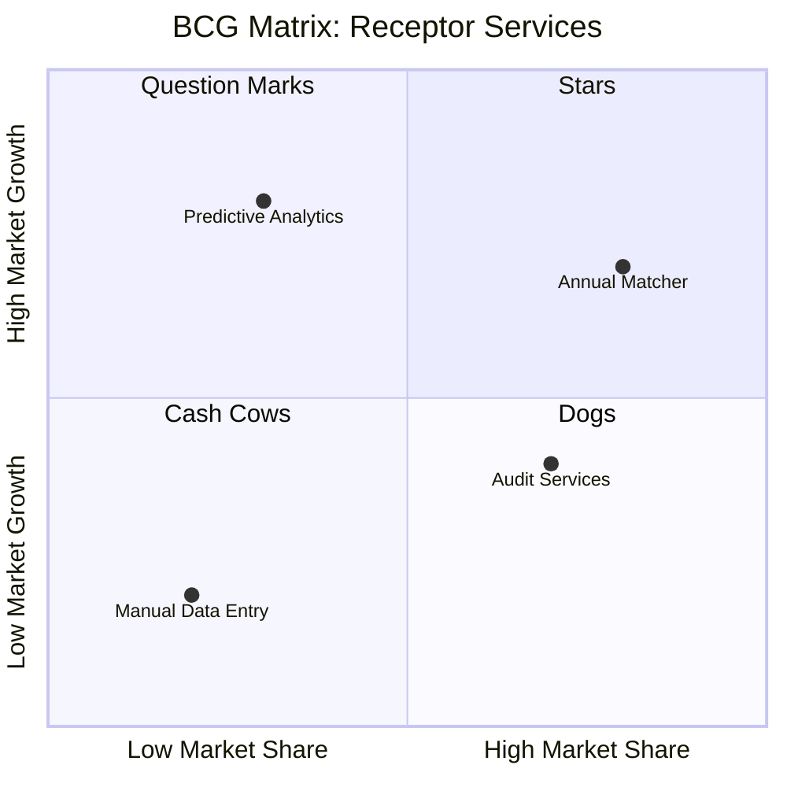

import { FrameworkCard, MatrixGrid, StrategicPillar } from '@site/src/components/BusinessPlanning';

# Portfolio Analysis

To manage our growth as a Hybrid SaaS + Consulting business, we use two primary strategic frameworks: the **BCG Matrix** and the **GE-McKinsey Nine-Box Matrix**.

## BCG Matrix (Product Portfolio)

This matrix maps our services based on **Market Growth** and **Relative Market Share**.

*   **Stars (Annual Matcher):** This is our core offering. High growth as hospitals digitise, and we have a strong niche share. **Strategy:** Invest to maintain leadership.
*   **Question Marks (Predictive Analytics):** High potential growth (Workforce Intelligence), but we currently have low market share. **Strategy:** Decide whether to invest heavily to turn into a Star.
*   **Cash Cows (Audit Services):** Low market growth (consulting is linear), but high share of our current revenue. **Strategy:** Milk to fund SaaS development.
*   **Dogs (Manual Data Entry):** Low growth and low share. **Strategy:** Divest or automate away.

### Strategic Highlights

<MatrixGrid columns={2}>
  <StrategicPillar 
    title="Core Star" 
    outcome="Annual Matcher" 
    icon="⭐️"
  />
  <StrategicPillar 
    title="Future Growth" 
    outcome="Predictive Analytics" 
    icon="🚀"
  />
</MatrixGrid>

---

## GE-McKinsey Nine-Box Matrix

This matrix evaluates our expansion opportunities across different regions/entities based on **Market Attractiveness** and **Competitive Strength**.

| | Low Strength | Medium Strength | High Strength |
|---|---|---|---|
| **High Attractiveness** | SA / WA Health (Target) | Regional VIC Networks | **Metro VIC LHNs (Current Focus)** |
| **Medium Attractiveness** | Specialist Colleges | NZ District Labs | Rural Victorian Services |
| **Low Attractiveness** | Private Clinics | Small Specialist Hubs | Internal Tooling |

### Strategic Direction:
1.  **Protect Position:** Focus on **Metro VIC LHNs**. We have high strength (frequent relationships) and it's a highly attractive market.
2.  **Invest to Grow:** **SA and WA Health** are highly attractive but our strength is currently low (no local pilot yet). Our goal is to move these to the right.
3.  **Selective Harvesting:** **Rural VIC Services** are medium attractiveness and we have high relative strength. We should implement these efficiently without excessive custom consulting.
