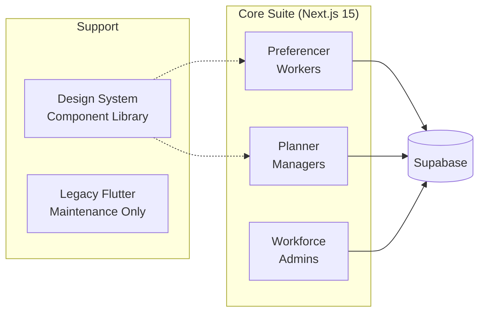

import { FrameworkCard, MatrixGrid, StrategicPillar } from '@site/src/components/BusinessPlanning';

# Strategic Architecture Evaluation

*Critical assessment of Receptor's technical readiness to deliver a performant, secure, scalable, and reliable SaaS + consulting platform for Australian hospital workforce management.*

**Evaluation Date:** February 2026

---

## Executive Summary

Receptor is **well-positioned** to deliver on its core vision of workforce planning and operations management for Australian hospitals. The architecture demonstrates strong foundations in:

- ✅ **Performance:** CP-SAT solver delivers optimal allocations in production
- ✅ **Security:** RLS-first approach with self-hosted data sovereignty
- ✅ **Scalability:** Modular frontend suite with clear separation of concerns
- ⚠️ **Reliability:** Testing infrastructure exists but requires completion

:::important Key Finding
The platform is technically capable of production delivery. The primary gaps are in **RLS policy completion** and **automated CI/CD pipeline maturity**—both are documented and tracked.
:::

---

## Scope Alignment

The stated vision covers:

| Capability | Product Status | Implementation |
|------------|----------------|----------------|
| Position Management | 🟠 In Progress | Workforce frontend |
| Job Line Planning | 🟢 Complete | Planner frontend |
| AMC Compliance | 🟡 Planned (FY27-28) | Extension service |
| Preferencing | 🟢 Complete | Preferencer frontend |
| Matching | 🟢 Complete | Allocator backend (CP-SAT) |
| Rotation Management | 🟡 Partial | Legacy Flutter prototype |
| Rotation Swaps | 🟡 Planned (FY27-28) | Extension service |
| Certificates of Service | 🟡 Planned (FY27-28) | Extension service |
| Rostering | ⚪ Out of Scope | Strategic service (FY29+) |

**Alignment Score:** The core workflow (preferencing → matching → allocation) is production-ready. Rotation management through the clinical year (swaps and certificates) is scoped as Extension Services, with legacy Flutter prototypes providing a template for Next.js porting.

---

## Performance Assessment

### Allocator Engine (match-backend)

<MatrixGrid columns={2}>
  <FrameworkCard title="Solver Technology" icon="⚡">
    **Google OR-Tools CP-SAT** — industry-standard constraint programming solver with proven performance on NP-hard matching problems. Architecture-independent (ARM64 compatible).
  </FrameworkCard>
  <FrameworkCard title="Integration Pattern" icon="🔗">
    **Stateless API** — clean separation from database layer via Supabase RPC. Decoupled design enables independent scaling and testing.
  </FrameworkCard>
</MatrixGrid>

**Strengths:**
- Proprietary dissatisfaction calculation (`exponentiated_preference`) balances worker vs organization needs
- Eligibility engine handles complex training constraints
- Test suite validates allocation outcomes against gold-standard datasets

**Concerns:**
- Single-instance deployment assumed; no documented horizontal scaling strategy
- Cold-start latency for large allocation runs not benchmarked

:::tip Recommendation
Establish performance baselines (e.g., 500-worker allocation in under 30 seconds) and document scaling path for statewide deployments.
:::

---

### Database Architecture

| Component | Technology | Assessment |
|-----------|------------|------------|
| Primary DB | PostgreSQL 15 | ✅ Production-grade |
| Schema | 4,665 lines declarative SQL | ✅ Well-structured |
| Extensions | pg_graphql, pgjwt, supabase_vault | ✅ Enterprise features |
| API Layer | PostgREST + Kong Gateway | ✅ Auto-generated REST |

The schema demonstrates maturity with proper separation into domain directories (`orgs`, `planning`, `preferencing`, `workers`). Declarative migration strategy prevents schema drift.

---

## Security Assessment

### Row Level Security (RLS)

<MatrixGrid columns={3}>
  <StrategicPillar title="End User" outcome="Own Data Only" icon="👤" />
  <StrategicPillar title="Workforce Manager" outcome="Org-Scoped" icon="👔" />
  <StrategicPillar title="Global Admin" outcome="Platform-Wide" icon="🔑" />
</MatrixGrid>

**Current State:**
- Policy architecture is well-designed with three-tier role model
- Declarative policy files exist in `11_policies` directory
- Helper functions (`is_global_admin()`, privilege checks) documented

:::warning Gap Identified
Security documentation shows TODO items for:
- [ ] Complete RBAC helper functions in `09_rbac`
- [ ] Audit `match` and `messages` schemas for RLS compliance
- [ ] Populate `auth.users` metadata for existing users
:::

**Data Sovereignty:**
The self-hosted Supabase deployment addresses hospital CIO concerns about multi-tenant SaaS. Docker-contained infrastructure with Cloudflare Tunnel enables secure external access without direct port exposure.

---

### Authentication Model

| Method | Use Case | Status |
|--------|----------|--------|
| Magic Link | Workers (low-friction onboarding) | ✅ Implemented |
| OAuth (Google/Apple) | SSO integration | ✅ Configured |
| Email/Password | Manager access | ✅ Implemented |
| Edge Function Auth | Session handoff flow | ✅ Custom implementation |

The authentication architecture appropriately segments access patterns by user persona.

---

## Scalability Assessment

### Frontend Architecture

**Scalability Strengths:**
- **Modular frontend suite:** Each app targets a specific persona, enabling independent deployment and scaling
- **Shared design system:** `design-frontend` establishes component consistency across management apps
- **Vanilla CSS design system:** No framework lock-in; maintainable long-term
- **App Router architecture:** Standard Next.js 15 patterns with services layer abstraction

**Multi-Tenancy Readiness:**
- Organization-scoped data model (`org_id` throughout schema)
- RLS policies designed for multi-org isolation
- Self-hosted deployment supports dedicated instances per health service if required

---

## Reliability Assessment

### Testing Infrastructure

| Layer | Framework | Coverage |
|-------|-----------|----------|
| Allocator Unit | pytest | ✅ Validated gold-standard datasets |
| Allocator Logic | pytest | ✅ Constraint and eligibility tests |
| Next.js Unit | Vitest | ✅ Component and service tests |
| Next.js E2E | Playwright | ✅ Multi-viewport (desktop/mobile) |
| Flutter Legacy | flutter test | ⚪ Maintenance only |
| Supabase | pgTAP (planned) | ⚠️ Not documented |

**Strengths:**
- Allocator test suite validates mathematical correctness against known-good outputs
- Playwright E2E covers authentication flows and preference workflows
- Global auth setup pattern enables efficient test execution

:::note Automated Security Verification
A robust suite of **pgTAP database tests** exists (`supabase/tests/database/`) covering:
- RLS policy activation across all public tables (`11_security_policies`)
- Functional RLS isolation for workers and preferences (`32_functional_rls`)
- Privilege-based access controls for ACL groups (`30_functional_privileges`)
:::

---

### Governance & Operations

The EOS (Entrepreneurial Operating System) framework provides:
- **V/TO** — Single-page strategy alignment
- **Accountability Chart** — Clear role ownership
- **Quarterly Rocks** — Focused execution

**Documentation Quality:** Comprehensive Docusaurus site with business planning, infrastructure, and app documentation. Agent rules enforce documentation synchronization.

---

## Gap Analysis

### Critical Gaps (Must Address Pre-Production)

| Gap | Risk | Remediation |
|-----|------|-------------|
| RLS helper functions incomplete | Unauthorized data access | Complete `09_rbac` implementation |
| User metadata migration pending | Role-based access broken | Execute auth.users metadata migration |
| No CI/CD pipeline documented | Deployment reliability | Implement GitLab CI/CD with staging gates |

### Important Gaps (Address in FY2027)

| Gap | Risk | Remediation |
|-----|------|-------------|
| Certificates of Service not scoped | Incomplete rotation lifecycle | Requirements gathering with pilot client |
| Performance benchmarks missing | Unknown scaling limits | Establish allocation timing baselines |
| Rotation swap workflow | Manual term management | Port from Flutter to Next.js suite |

### Strategic Gaps (FY2028+ Roadmap)

| Gap | Risk | Remediation |
|-----|------|-------------|
| Rostering integration | Incomplete end-to-end workflow | Partnership strategy with HealthRoster/Kronos |
| Interstate data portability | Limited expansion capability | Unified profile architecture design |

---

## Recommendations

### Immediate Actions (Q1-Q2 FY2027)

1. **Complete RLS Implementation**
   - Finalize RBAC helper functions
   - Maintain and expand automated RLS policy tests (pgTAP)
   - Execute user metadata migration

2. **Establish CI/CD Pipeline**
   - GitLab CI for all repositories
   - Staging environment with seed data
   - Automated E2E gates before production

3. **Document Performance Baselines**
   - Benchmark 500-worker allocation scenarios
   - Establish SLA targets for allocation runs

### Near-Term Actions (FY2027-28)

4. **Port Rotation Management**
   - Migrate `rotator_worker` rotation swap logic to Next.js
   - Scope Certificates of Service requirements

5. **AMC Compliance Module**
   - Implement EPA tracking
   - Automated term type validation

---

## Conclusion

Receptor's architecture is **fundamentally sound** for delivering the stated vision of workforce planning and operations management. The platform demonstrates:

- **Technical sophistication** in the allocator engine and database design
- **Appropriate security posture** for healthcare data
- **Scalable architecture** supporting multi-organization deployment
- **Clear governance** through EOS and documented processes

The primary work remaining is **operational hardening**: completing RLS policies, establishing CI/CD pipelines, and porting legacy rotation management features. These are tracked, scoped items rather than fundamental architectural concerns.

:::tip Overall Assessment
✅ **On Track** — Receptor is ready for pilot deployment with documented gaps actively being addressed. The Doctor-Developer advantage enables rapid iteration as gaps are identified during real-world usage.
:::

---

## Related Documents

- [V/TO (Strategy Core)](../operations/eos/vto)
- [Product Roadmap](../product/product-roadmap)
- [Service Catalog](../product/service-catalog)
- [Scope & Boundaries](./scope)
- [SWOT Analysis](./swot)
- [Architecture Design](/docs/app-documentation/architecture)
- [RLS Policies](/docs/infrastructure/rls-policies)
- [Testing Guide](/docs/infrastructure/testing-guide)
