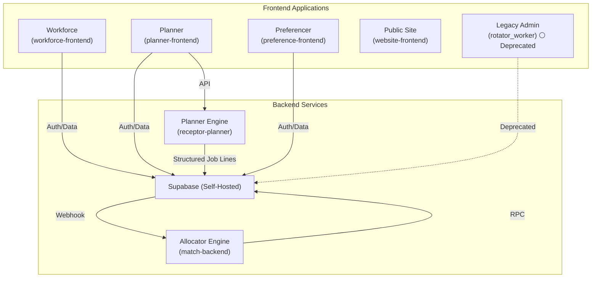
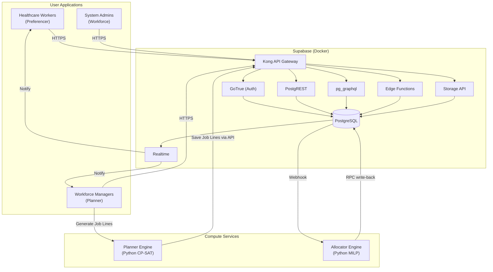

# Receptor Ecosystem Architecture

> Cross-repo overview of the Receptor platform components and their data flows.

---

## Component Overview

The platform is divided into four specialised frontend applications, two Python
compute services, and a self-hosted Supabase backend:



| Component        | Target Users          | Responsibilities                                            | Status        |
| :--------------- | :-------------------- | :---------------------------------------------------------- | :------------ |
| **Workforce**    | System Administrators | Organisations, teams, categories, locations, positions      | 🟡 Active     |
| **Planner**      | Workforce Managers    | Algorithmic job line structure generation and mapping       | 🟢 Complete   |
| **Preferencer**  | Healthcare Workers    | Preference submission, profile management, rotation viewing | 🟢 Complete   |
| **Allocator**    | System / Managers     | The matching engine that assigns doctors to job lines       | 🟢 Complete   |
| **Legacy Admin** | (Deprecated)          | All admin functions — being replaced by the apps above      | ⚪ Deprecated |

---

## Technology Stack

| Layer                    | Technology                      | Repository            |
| :----------------------- | :------------------------------ | :-------------------- |
| **Workforce Frontend**   | Next.js 16+, TypeScript, Urql   | `workforce-frontend`  |
| **Planner Frontend**     | Next.js 16+, TypeScript, Urql   | `planner-frontend`    |
| **Preferencer Frontend** | Next.js 16+, TypeScript, Urql   | `preference-frontend` |
| **Public Site**          | Next.js                         | `website-frontend`    |
| **Legacy Admin**         | Flutter / Dart                  | `rotator_worker`      |
| **Backend-as-a-Service** | Supabase (self-hosted Docker)   | `supabase-receptor`   |
| **Planner Engine**       | Python CP-SAT Solver (OR-Tools) | `receptor-planner`    |
| **Allocator Engine**     | Python MILP Solver              | `match-backend`       |

### Next.js Application Structure

All Next.js apps follow a consistent `src/` layout:

```
src/
├── app/            # Next.js App Router (pages, layouts, server actions)
├── components/     # React UI components
├── graphql/
│   └── operations.ts  # All queries, mutations, fragments (SSOT)
├── hooks/          # Domain-specific React hooks
├── lib/graphql/
│   └── client.ts   # Urql client (Graphcache + authExchange + persist)
├── providers/      # React Context providers (Auth, Org, Plan, Permission)
├── services/       # Pure API orchestration (no React)
├── test/           # Vitest test setup, MSW mocks, test-wrapper
└── types/          # Generated TypeScript types (from DB schema)
```

---

## Supabase Services

The self-hosted Supabase instance provides:

| Service            | Purpose                                                                      |
| :----------------- | :--------------------------------------------------------------------------- |
| **PostgreSQL 15**  | Primary database with Row Level Security                                     |
| **GoTrue**         | Authentication (OAuth, Magic Links, Email/Password)                          |
| **PostgREST**      | Auto-generated REST API (used for admin operations; app data via pg_graphql) |
| **pg_graphql**     | GraphQL API consumed by all frontend apps via Urql                           |
| **Realtime v2**    | Live updates on allocation statuses                                          |
| **Storage API**    | Qualification documents and attachments                                      |
| **Edge Functions** | Custom server-side logic (auth handlers, pre-flight gates)                   |
| **Kong Gateway**   | API routing and rate limiting                                                |

---

## Infrastructure Diagram



> [!TIP]
> **Design Principle:** The Python Allocator Engine is the "brain" of Receptor.
> Keep it independent of the database schema by communicating through a clean
> API layer — this allows the matching algorithm to be tested and scaled in
> isolation.

---

## Security Model

Each frontend has distinct access patterns enforced by Supabase RLS:

| App             | Auth Method            | RLS Enforcement                                       |
| :-------------- | :--------------------- | :---------------------------------------------------- |
| **Preferencer** | Magic Link / OAuth     | Workers can only view/modify their own preferences    |
| **Planner**     | Email/Password + OAuth | Manager role required for allocation operations       |
| **Workforce**   | Email/Password + OAuth | System Admin role required for organisational changes |

JWT claims (`global_roles`, `worker_contexts`) drive UI visibility and routing.
Supabase RLS is the authoritative security enforcement layer for all data
mutations.

---

## See Also

- [Frontend Standards](./frontend-standards-overview.md) — Engineering standards
  for all frontends
- [GraphQL Standard](./graphql-standard.md) — Urql client and data fetching
  patterns
- [Cluster Infrastructure](./cluster-infrastructure.md) — Physical hosts, VMs,
  k3s node topology, and provisioning runbook
