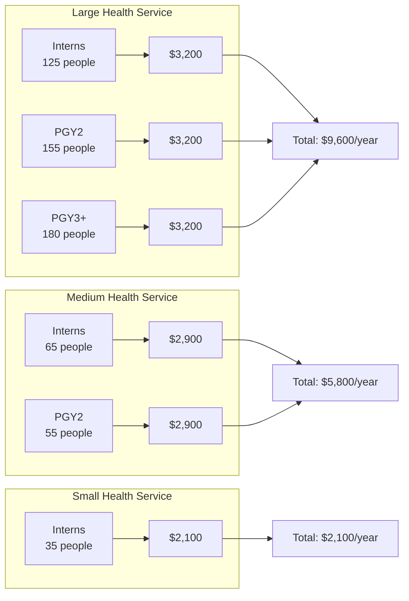

# Revenue & Sustainability Model

The long-term success of Receptor depends on a sustainable revenue model that balances the needs of public health services with the commercial requirements for continuous development.

---

## 1. Core Service: Preferencing & Allocation

Receptor's primary revenue stream is the **Preferencing and Allocation Service** - a per-match fee model that scales with the size of each allocation cohort.

### Service Inclusions

Each match includes:

| **Component** | **Description** |
|---------------|-----------------|
| **Job Line Preparation** | Configuration and setup of available positions/rotations |
| **Preference Collection** | Secure portal for individual preference submission |
| **Preference Analysis** | Review of preference patterns and conflict identification |
| **Optimised Matching** | Mixed Integer Linear Programming (MILP)-based allocation algorithm execution |
| **Allocation Delivery** | Results distribution and appeals management support |

---

## 2. Pricing Structure

All prices are **per match, excluding GST**. A "match" is defined as a single allocation cycle for a specific cohort (e.g., Interns, PGY2, PGY3+).

### 2.1 Standard Pricing Tiers

| **Cohort Size** | **Price per Match** | **Price incl. GST** |
|-----------------|--------------------|--------------------|
| Up to 50 people | **$2,100** | $2,310 |
| Up to 100 people | **$2,900** | $3,190 |
| Over 100 people | **$3,200** | $3,520 |

### 2.2 Pricing Examples

| **Example Organisation** | **Matches** | **Annual Revenue** |
|--------------------------|-------------|-------------------|
| **Monash Health** (VIC) | 3 matches (Interns, PGY2, PGY3+) × >100 each | **$9,600** |
| **Alfred Health** (VIC) | 2 matches (Interns 74, PGY2 68) | **$5,800** |
| **Austin Health** (VIC) | 2 matches (Interns 65, PGY2) | **$5,800** |
| **Bendigo Health** (VIC) | 1 match (Interns 40) | **$2,100** |
| **SALHN** (SA) | 2 matches (Interns ~85, PGY2) | **$5,800** |

---

## 3. Additional Revenue Streams

### A. Implementation & Onboarding Fees

One-off fees for initial setup and integration:

| **Service** | **Fee** | **Description** |
|-------------|---------|-----------------|
| **Standard Onboarding** | $1,500 | Account setup, training, data import |
| **Custom Integration** | $3,000 - $8,000 | HIS/HRMIS API connectivity |
| **Data Migration** | $2,000 - $5,000 | Legacy system data cleaning and import |

### B. Premium Add-ons (Future)

Optional premium tiers for enhanced capabilities:

| **Add-on** | **Annual Fee** | **Description** |
|------------|---------------|-----------------|
| **Predictive Analytics** | $5,000+ | Workforce attrition trends, burnout risk modeling |
| **Advanced Reporting** | $2,500+ | Custom dashboards, board-level reporting |
| **Multi-Site Orchestration** | $4,000+ | Cross-campus allocation coordination |
| **API Access** | $3,000+ | Programmatic access for internal systems |

### C. Consulting & Support

| **Service** | **Rate** | **Description** |
|-------------|----------|-----------------|
| **Workforce Planning Consultation** | $200/hour | Strategic allocation advice |
| **Priority Support SLA** | $2,000/year | Guaranteed 4-hour response during match periods |
| **Custom Development** | $180/hour | Bespoke feature development |

---

## 4. Sustainability Goals

| **Goal** | **Target** | **Strategy** |
|----------|-----------|--------------|
| **Self-Sufficiency** | 100% OpEx coverage by FY28 | Scale to 15+ health service contracts |
| **Gross Margin** | >70% | Low marginal cost per additional match |
| **Customer Retention** | >95% annually | Embed into annual workforce planning cycle |

### Non-Dilutive Revenue Opportunities

- **R&D Tax Incentive:** Claim on allocation algorithm development
- **Research Grants:** Partner with universities for workforce research
- **State Contracts:** Long-term agreements with Departments of Health

---

## 5. Revenue Model Assumptions

| **Assumption** | **Value** | **Rationale** |
|----------------|----------|---------------|
| **Average matches per client** | 2.5 | Most run Intern + PGY2; larger run PGY3+ |
| **Average revenue per client** | $6,500 | Weighted by cohort size distribution |
| **Acquisition cost** | $1,500 | Sales effort + onboarding |
| **Churn rate** | < 5% | High switching costs + annual cycle lock-in |
| **Time to close** | 3-6 months | Government procurement cycles |

---

## 6. Additional Revenue Stream: Vocational Training

Beyond prevocational (Intern, PGY2, PGY3+) matching, there is significant opportunity in **vocational (registrar and fellowship) training** allocation.

### High-Potential Specialties (≥14 trainees/specialty)

| **Specialty** | **College** | **Est. Metro Registrars** | **Revenue Potential** |
|---------------|-------------|---------------------------|----------------------|
| **General Practice** | RACGP/ACRRM | **350-400+** | **$3,200 - $12,800/year** |
| Emergency Medicine | ACEM | 150-180 | $20,000 - $25,600/year |
| Basic Physician Training | RACP | 300-400 | $35,000 - $46,400/year |
| Psychiatry | RANZCP | 60-80 | $6,400 - $9,600/year |
| Anaesthesia | ANZCA | 80-115 | $9,600 - $12,800/year |
| General Surgery | RACS | 50-70 | $14,500 - $17,400/year |

**Total Vocational Revenue Potential:** $91,000 - $144,000/year (full adoption)

For detailed specialty-by-specialty analysis, see:
- 🩺 **[Vocational Training Analysis](../../strategy/research/vocational-training-analysis.md)** - Registrar numbers by specialty and health service

---

## 7. Detailed Projections

For comprehensive pricing projections by region and phase, see:
- 📊 **[Pricing Projections](./pricing-projections.md)** - Detailed Melbourne Metro, Regional, SA & WA analysis
- 🩺 **[Vocational Training Analysis](../../strategy/research/vocational-training-analysis.md)** - Registrar/fellowship training opportunities
