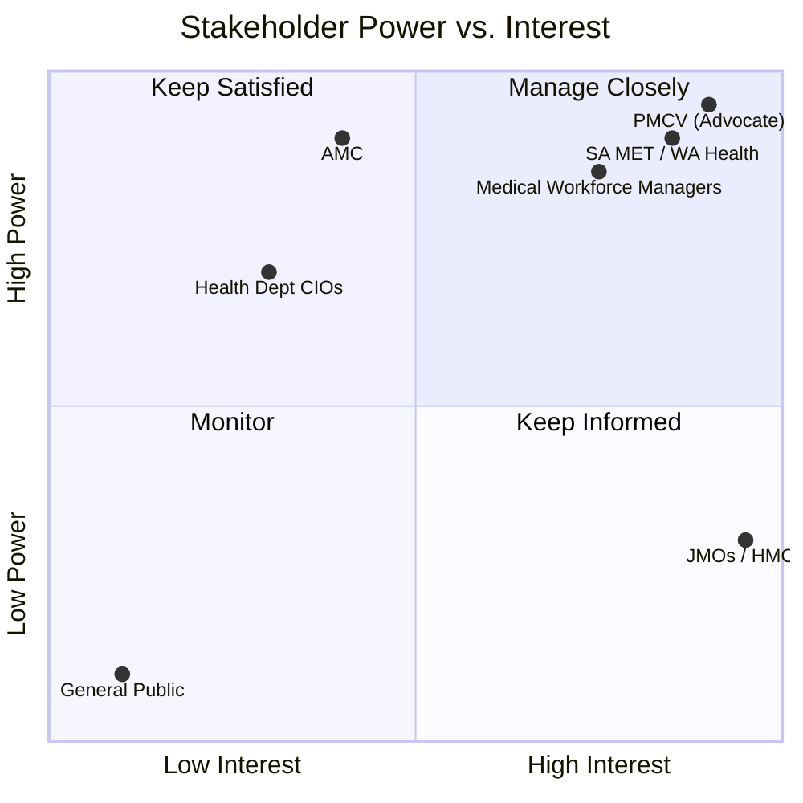

# Go-to-Market Strategy: Australian Health Tech Expansion

## Executive Summary

This strategy outlines the expansion of our medical rotation and allocation system into South Australia (SA) and Western Australia (WA), leveraging the 'Victorian Blueprint' from the Postgraduate Medical Council of Victoria (PMCV) as a proof-of-concept. Our focus is on solving the critical pain points of Junior Medical Officer (JMO) and Hospital Medical Officer (HMO) rotation planning through automation, transparency, and alignment with national standards.

## 1. Stakeholder Analysis & Expansion Map

### South Australia (Adelaide)
- **Primary Body:** SA MET (South Australian Medical Education and Training).
- **Expansion Focus:** Automating the randomized ballot for PGY1 and the merit-based matching for PGY2+ across the Local Hospital Networks (LHNs).
- **Key Regions:** Central Adelaide Local Hospital Network (LHN)—Royal Adelaide Hospital; Southern Adelaide LHN—Flinders Medical Centre; Northern Adelaide LHN—Lyell McEwin Hospital.

### Western Australia
- **Primary Body:** WA Health & WACHS (WA Country Health Service).
- **Expansion Focus:** Optimization of rural rotations and interstate graduate intake. Integration with credentialing workflows (CredWA).
- **Key Regions:** Perth metropolitan (North/South/East Metro Health Services), WACHS (Regional WA).

---

## 2. The 'Victorian Blueprint': PMCV Advocacy

PMCV is our strategic beachhead. Our value proposition addresses three critical concerns:

> **For Directors of Medical Services:** "De-risk workforce retention by giving trainees the rotations they want—Receptor's Glass Box approach ensures every allocation is explainable and auditable."

**Key Value Pillars:**

| Pillar | PMCV Benefit |
|--------|--------------|
| **Workforce Retention Assurance** | Reduce PGY1 attrition by placing graduates in preferred placements |
| **Transparency ("Glass Box")** | Transform the Victorian Intern Match from opaque to fully auditable |
| **Employer of Choice** | Position Victorian Health Services as leaders in fair allocation |

**Operational Benefits:**
- **Administrative Efficiency:** Automate referee follow-ups and eligibility verification
- **Rural Equity:** Dynamic weighting to incentivise rural and regional placements (VRGP alignment)

---

## 3. Interstate Equivalents & Pain Points

| State | Equivalent Body | Key Pain Points | Feature Alignment |
|-------|-----------------|-----------------|-------------------|
| **SA** | **SA MET** | Manual eligibility verification; Oversubscribed LHN ballot stress. | Automated verification engine; Robust randomized allocation logic. |
| **WA** | **WA Health / WACHS** | Rural term allocation complexity; Disconnect between recruitment (MedCareersWA) and rotation allocation. | Rural-specific rotation logic; Streamlined allocation workflow. |

---

## 4. The National Authority: AMC Alignment
Our software is designed to align with the **Australian Medical Council (AMC)** National Framework for Prevocational Medical Training:

- **Entrustable Professional Activities (EPAs):** Our system maps rotations to specific EPA opportunities, ensuring JMOs meet their 'supervised practice' requirements.
- **Feedback Loops:** Integrated tools for observed clinical practice feedback, aligning with the AMC’s shift towards continuous assessment.
- **National Portability:** Supporting the transition to the CLA (Clinical Learning Australia) ePortfolio.

---

## 5. Decision-Makers & Power-Brokers ('Opportune Clients')

### SA Health (LHNs)

- **Director of Clinical Training (DCT):** Focused on educational quality and Entrustable Professional Activity (EPA) compliance.
- **Medical Workforce Manager:** Focused on allocation, fatigue management, and filling 'unpopular' rotations.
- **Chief Information Officer (CIO):** Focused on security (Supabase/Docker) and integration with existing HRMIS.

### WA Country Health Service (WACHS)
- **Executive Director Medical Services (EDMS):** Interested in state-wide workforce stability and rural retention.
- **Regional Workforce Leads:** Managing the logistics of doctors moving between metro and regional sites.

---

## 6. Engagement Strategy: Pitch Hierarchy

### Adelaide (First Leg)
1. **SA MET Executive Officer:** Gain 'top-down' buy-in for a pilot in a single LHN.
2. **Medical Workforce Managers (CALHN/SALHN):** Demonstrate the 'ground-level' efficiency gains in rotation planning.
3. **JMO Forum Representatives:** Build 'grassroots' support by highlighting the transparency of the preference system.

### Perth (Second Leg)
1. **WACHS Medical Workforce Lead:** Crucial for the rural rotation use-case.
2. **PMCWA (Postgraduate Medical Council WA):** Establish professional accreditation alignment.
3. **North/South Metro DCTs:** Focus on metropolitan training capacity and EPA tracking.

---

## 7. Stakeholder Power/Interest Matrix

---

## 8. Territory Action Plan

| Phase | Activity | Milestone |
|-------|----------|-----------|
| **Phase 1** | SA MET Engagement | Pilot agreement with one SA LHN for 2026 rotation cycle. |
| **Phase 2** | WACHS Integration | Prototype development for 'Rural Swing' rotations (Metro -> Rural). |
| **Phase 3** | AMC/CLA Sync | API integration with National ePortfolio (CLA) for EPA tracking. |
| **Phase 4** | State-wide Rollout| Mandatory adoption of the 'Victorian Blueprint' across SA and WA. |
