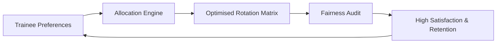

# Competitor Analysis & Strategy

This document outlines the competitive landscape for Receptor, identifying our core advantages, key differentiators, and strategic positioning.

## 1. The Core Value Proposition

Receptor operates as a **SaaS + Consulting** model, delivering rotation allocation solutions directly to Health Services. We do not offer daily shift rostering—we create the compliant allocation matrix that feeds those systems.

**Value Pillars:**

| Pillar | Description |
|--------|-------------|
| **Workforce Retention Assurance** | De-risk workforce planning by placing trainees in preferred rotations, reducing attrition |
| **Transparency ("The Glass Box")** | Every allocation decision is explainable and auditable—no opaque algorithms |
| **Employer of Choice** | Health Services using Receptor demonstrate commitment to fair, preference-driven placement |

---

## 2. The Doctor-Developer Advantage

Receptor is founded by a **Doctor-Developer**—a practising clinician with software engineering expertise. This dual capability delivers:

- **Clinical Credibility:** Deep understanding of rotation constraints, training requirements, and JMO experience
- **Technical Velocity:** Direct translation of clinical requirements into working software without intermediary miscommunication
- **Cost Efficiency:** Reduced external development costs; rapid iteration cycles
- **Stakeholder Trust:** Medical Directors and DCTs engage with a peer, not a vendor

---

## 3. Direct Competitor Mapping

| Competitor | Core Market | Known Feature Set | Receptor Comparison |
| :--- | :--- | :--- | :--- |
| **Placeright** | AU State Health (Vic) | Large-scale clinical placement tracking; free for Vic public hospitals | **Receptor wins on UX/UI** and modern preference lodgement. Placeright is rigid and legacy-bound. |
| **InPlace Network** | Enterprise (Private/Public) | Full student/staff lifecycle management; deeply integrated with legacy SIS/HRIS | **Receptor is purpose-built.** InPlace is a comprehensive enterprise suite; Receptor is specialised for rotation allocation fairness. |
| **MedHub (eValue)** | Global Academic Medicine | Comprehensive evaluations, scheduling, and compliance for residency programs | **Local expertise.** MedHub is US-centric. Receptor is built for Australian rotation rules and training requirements. |
| **Clinician Nexus** | System-wide Scheduling | Collaborative scheduling and onboarding for multi-system health groups | **Differentiated scope.** Clinician Nexus handles daily rostering. Receptor handles upstream allocation—the two are complementary. |

---

## 4. Gap Analysis

| Feature Area | Receptor Strength | Development Opportunity |
| :--- | :--- | :--- |
| **Data Sovereignty** | **Self-hosting via Supabase** allows Health Services to keep clinical data in-house | Future integration with Chris21/SAP payroll systems |
| **Allocative Fairness** | Proprietary Python-based allocation engine optimised for satisfaction maximisation | Enhanced reporting/analytics dashboard for hospital boards |
| **Access Control** | **Modern Row Level Security (RLS)** ensures strict "need to know" access | Automated self-service onboarding for new organisations |

---

## 5. Defensibility Moat

Our competitive moat is built on three pillars:

1.  **Architecture (Trust Moat):** Self-hosted, Docker-contained deployment addresses security concerns of hospital CIOs wary of multi-tenant SaaS.
2.  **Privacy (RLS Moat):** Database-level isolation via Postgres Row Level Security is more robust than application-layer access control.
3.  **Domain Expertise (Clinical Moat):** Our allocator is built by a clinician, for clinicians—specifically for Australian medical rotation constraints, state-based seniority rules, and training program requirements.

---

## 6. Strategic Roadmap Priorities

Based on competitor gaps, these features differentiate Receptor:

1.  **"Fairness Simulation" Mode:** Enable Medical Workforce Managers to dry-run allocations and view "Fairness Scores" (e.g., Gini coefficient of satisfaction) before publishing.
2.  **Chris21/SAP Import Wizard:** Simplified ingestion of staff lists from common Australian hospital payroll systems.
3.  **Mobile-First "Quick-Rank":** Optimised swipe-based preferencing interface for trainees on the ward.

---

:::tip Strategic Positioning
Competitors like InPlace offer "everything for everyone." Receptor occupies a defensible niche: **rotation allocation fairness for Australian Health Services.** We complement—not compete with—daily rostering systems. Our brand signals that we are not an HR tool; we are a **workforce retention platform**.
:::
