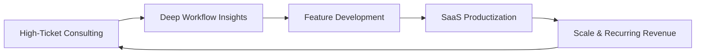

import { FrameworkCard, MatrixGrid, StrategicPillar } from '@site/src/components/BusinessPlanning';

# Modern Consultant's Framework

Receptor operates on a **Hybrid SaaS + Consulting** model, a core tenet of the Modern Consultant's Framework. This approach ensures that our software remains grounded in clinical reality while delivering high-margin strategic value.

## The Flywheel: Consulting + SaaS

Our business model is a self-reinforcing loop:

<MatrixGrid columns={3}>
  <StrategicPillar 
    title="High-Ticket Consulting" 
    outcome="Input" 
    icon="🤝"
  />
  <StrategicPillar 
    title="Workflow Insights" 
    outcome="Intelligence" 
    icon="🧠"
  />
  <StrategicPillar 
    title="SaaS Productization" 
    outcome="Output" 
    icon="⚙️"
  />
</MatrixGrid>

### 1. High-Ticket Consulting (The Input)
We begin engagements with **Allocation Audits** and **Constraint Mapping Workshops**. These are premium services where we identify the specific friction points in a health service's current manual processes.
*   **Outcome:** Paid research and development. We are paid to learn about new edge cases.

### 2. Deep Workflow Insights
The consulting phase reveals patterns that are universal but often hidden. For example, the transition from 5-term to 4-term rotations isn't just a calendar change; it's a change management challenge.

### 3. SaaS Productization (The Output)
Insights from consulting are baked into the **Receptor Matcher** and **Preferencer**. What was once a custom spreadsheet for one hospital becomes a configurable feature for all.

---

## The "Audience of One" Strategy

In Australian healthcare procurement, success with a single Metropolitan Local Health Network (LHN) creates a "halo effect."

*   **Target:** A single, respected "Lighthouse" client (e.g., Monash Health).
*   **Objective:** Solve 100% of their complex matching needs.
*   **Impact:** Use this success as the definitive case study to bypass traditional cold sales.

---

## Building Authority through Education

A modern consultant doesn't sell; they educate. Our marketing is focused on authority:
*   **Whitepapers:** Translating AMC Framework 2024 requirements into technical logic.
*   **The Doctor-Developer Voice:** Leveraging the founder's clinical credibility to speak directly to Directors of Medical Services (DMS).
