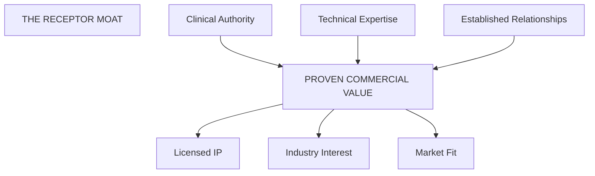

import { FrameworkCard, MatrixGrid, StrategicPillar } from '@site/src/components/BusinessPlanning';

# Competitive Strengths

**How We Win: The unique advantages that position Receptor to lead the medical allocation market.**

This document consolidates Receptor's core competitive differentiators—the tangible assets, credentials, and strategic positioning that set us apart from alternatives.

---

## 1. The Doctor-Developer Advantage

Receptor is uniquely positioned to bridge the gap between clinical reality and corporate strategy because of our founder's dual professional DNA:

| Dimension | Advantage | Impact |
|-----------|-----------|--------|
| **Clinical Authority** | Current **hospital doctor** with active practice and years of experience in **workforce management**. | Solutions meet doctors "where they are at," addressing fatigue and work-life balance from the inside. |
| **Technical & Corporate Expertise** | **Degree-qualified engineer (15+ years experience)** with the skills to navigate complex government and private infrastructure. | Enterprise-grade architecture built with modern DevOps and Security best practices. |
| **Strategic Agility** | **Common Bond** operates with the speed and cost-effectiveness that large consultancies cannot match. | Rapid execution, lean overhead, and outcomes at a fraction of the cost of traditional enterprise vendors. |

:::tip
**The Translation Layer:** We possess the unique ability to translate between the "shop floor" needs of junior doctors and the strategic imperatives of health executives. This bilingual fluency is rare and difficult to replicate.
:::

---

## 2. Competitive Differentiation

When compared to the alternatives, Receptor wins on multiple fronts:

| Alternative | Why We Win |
|-------------|------------|
| **Excel Spreadsheets** | We provide audit trails, logic, and scalability. Spreadsheets are high-risk, low-auditability, and cannot scale across sites. |
| **Rostering Software** | We handle *allocation* (months ahead), they handle *rostering* (days ahead). We are the "Brain" that feeds them. |
| **Legacy HR Systems** | We are "Doctor-First" design, not "Admin-First" data entry. Our UX is built for the clinician, not the back-office. |
| **Enterprise Consultancies** | We deliver working software, not PowerPoint decks. Our founder *is* the domain expert, eliminating the learning curve. |

---

## 3. Established Workforce Relationships

Beyond technical credentials, our founder brings direct experience in critical workforce initiatives:

<MatrixGrid columns={3}>
  <FrameworkCard title="AMC Category Adaptation" icon="📋">
    Adapting rotations to meet the updated **AMC Clinical Experience** categories.
  </FrameworkCard>
  <FrameworkCard title="Term Transition" icon="🗓️">
    Leading the complex move from **5-term to 4-term** annual rotation schedules.
  </FrameworkCard>
  <FrameworkCard title="Job Line Planning" icon="🗺️">
    Designing preference-driven allocation processes for large JMO cohorts.
  </FrameworkCard>
</MatrixGrid>

:::tip
**Case Study Potential:** These projects represent real-world experience that informs our Case Study narratives, providing authentic, relatable stories for Workforce Managers.
:::

---

## 4. The Receptor Moat

These strengths are not aspirational—they are **existing assets**. Every competitor would need years of domain immersion and relationship-building to replicate what Receptor already has.
