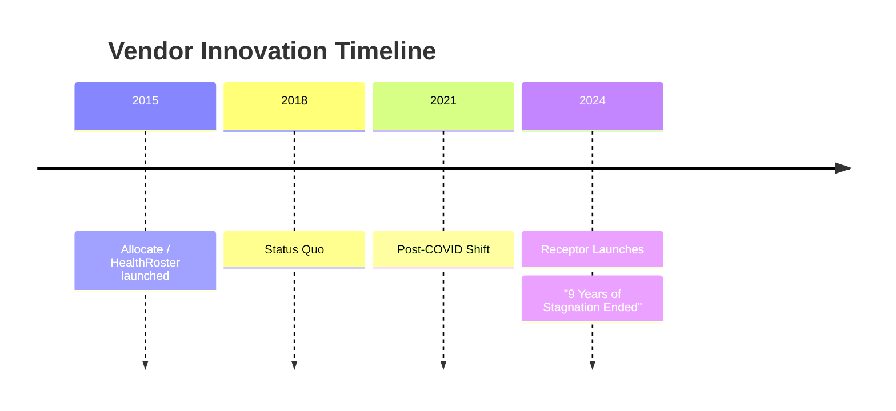

import { FrameworkCard, MatrixGrid, StrategicPillar } from '@site/src/components/BusinessPlanning';

# Why Now?

**The Convergence of Three Market Forces making Receptor essential today.**

Australian healthcare is at a tipping point. Manual processes are no longer just an "inefficiency"—they are a clinical and regulatory risk.

---

## 1. The Retention Crisis (Urgency)

The COVID-19 pandemic fundamentally changed workforce expectations. Junior doctors cite "lack of control" and "opaque administrative legacy" as primary reasons for leaving the public system.

### Workforce Fatigue Metrics

| Metric | Pre-COVID | Post-COVID | Change |
|--------|-----------|------------|--------|
| **Burnout Prevalence** | 35% | 55% | **+57%** |
| **Intent to Leave** | 15% | 28% | **+87%** |
| **Flexibility Priority** | Medium | **Critical** | ↑↑↑ |

> **Fairness in allocation is now a core retention strategy.**

---

## 2. The AMC Framework 2024 (Compliance)

The **Australian Medical Council's new Prevocational Framework** introduces stricter requirements for rotation variety and clinical exposure. 
*   Spreadsheets cannot maintain these audit trails. 
*   Accreditation depends on verifiable, rule-based matching logic.

---

## 3. The Innovation Gap (Timing)

The legacy vendor landscape has not evolved in over a decade. Large enterprise vendors (SAP, Oracle) have not entered this niche, leaving a clear "window of opportunity."



---

## 4. Digital Health Momentum (ROI)

State health departments (Victoria, SA, WA) are actively seeking "Digital Health" solutions that prove ROI through operational efficiency.

### Funding & Regulatory Landscape

| Force | Impact | Relevance to Receptor |
|-------|--------|----------------------|
| **Grant Funding** | Medical Research Future Fund (MRFF) | High alignment with workforce innovation. |
| **Digital Mandate** | Victorian Digital Health Framework | Directly aligned with modernization targets. |
| **Interoperability** | Move to API-First Architectures | Receptor feeds downstream rostering via API. |

---

## The Perfect Storm

```mermaid
graph LR
    R[RETENTION CRISIS] --> S[PERFECT STORM]
    C[COMPLIANCE (AMC 2024)] --> S
    I[INNOVATION GAP] --> S
    S --> Launch[RECEPTOR'S WINDOW: 2024 - 2026]
```
